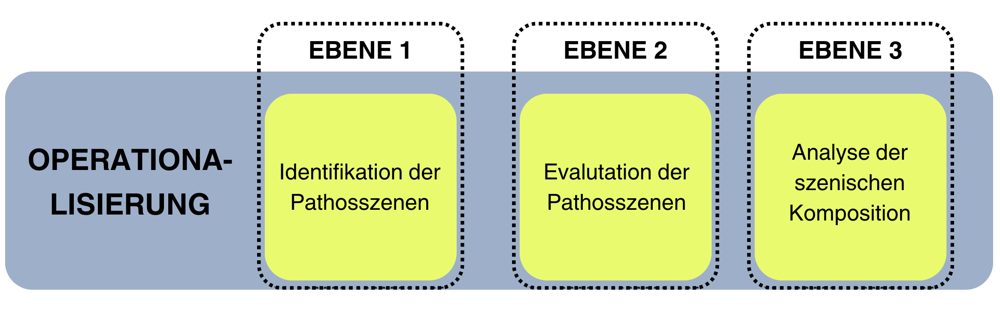
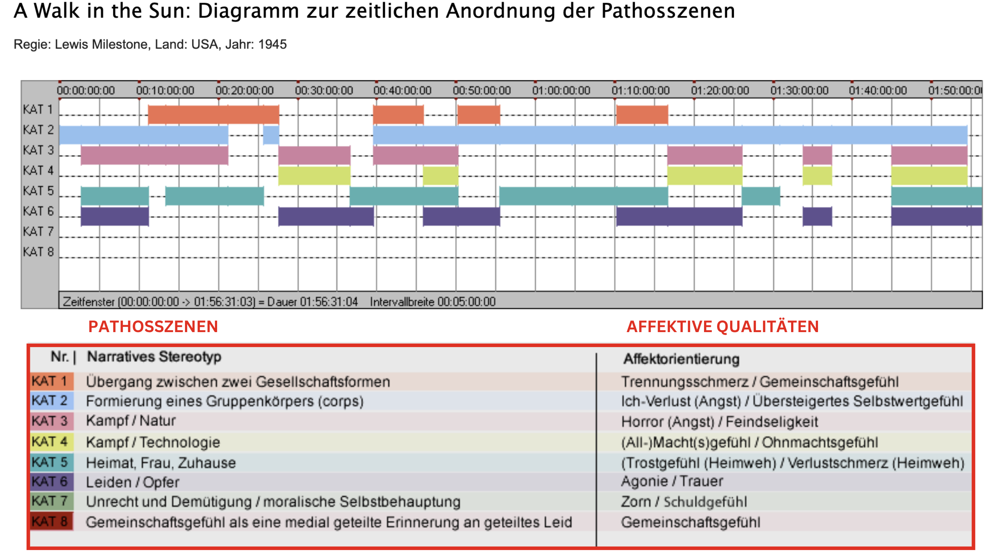

# Empirische Medienästhetik: Die eMAEX-Methode

Neben Handbüchern, Lexika und Glossaren gibt es auch empirische Ansätze, die in ihrem methodischen Vorgehen darauf abzielen, deskriptive Datenmodelle und Designs für die Filmwissenschaft aufzubereiten. <br>
Unter der Leitung von [Prof. Dr. Hermann Kappelhoff](https://www.cinepoetics.fu-berlin.de/about/sprecher/kappelhoff/index.html) wurde am interdisziplinären Exzellenzcluster [Languages of Emotion](http://www.loe.fu-berlin.de/) (Laufzeit: 2007–2014) angesiedelt an der [Freien Universität Berlin](https://www.fu-berlin.de/) die sogenannte [eMAEX-Methode](https://www.empirische-medienaesthetik.fu-berlin.de/) entwickelt. eMAEX steht für *electronically based media analysis of expressive-movement-images* und beschreibt ein empirisches Vorgehen zur Erfassung und "systematischen Erschließung der Ausdrucksqualitäten audiovisueller Bewegungsbilder". Im Vordergrund des Ansatzes steht ein Framework, das auf qualitative Empirie abzielt:

>Qualitativ-deskriptive Empirie heißt für uns, dass jede analytische Aussage, jede genretheoretische oder filmhistorische These am Gegenstand überprüfbar und nachvollziehbar ist.

Das Beschreibungsmodell der quantitativen Bewegtbildanalyse zielt auf die affektorientierte Funktion audiovisueller Bildinszenierungen auf der Grundlage ihrer zeitlichen Gestalt ab. Wie können analytische Beschreibungen ästhetische Strategien der Emotionalisierung anhand temporaler "Ausdrucksbewegungen" methodisch fassen?
+++
Um diese Frage zu beantworten, wurde ein dreistufiges Analysemodell entwickelt:



````{margin}
```{admonition} Was ist eine Pathosszene?
Im Rahmen der Filmsegmentierung der eMAEX-Methode wurden genrespezifische Standard-Szenen kategorisiert, denen bestimmte affektive Qualitäten zugeordnet werden können. Eine Übersicht der Pathosszenen des Kriegsfilm-Projektes findet sich [hier](https://www.empirische-medienaesthetik.fu-berlin.de/emaex-system/affektdatenmatrix/kategorien/index.html). Detaillierte Informationen zum Konzept der Pathosszene können ebenfalls [hier](https://www.cinepoetics.fu-berlin.de/methods/2_Anwendung_und_Perspektiven/1_Genre-und-Gefuehle_Pathosszene-und-Affektdramaturgie/index.html) abgerufen werden. 
```
````
 
**Identifikation**
+++
1. Szenensegmentierung Pathosszenen: Die zeitliche Segmentierung eines Film nach Szenen und die Bestimmung dieser Szenen nach Pathoskategorien (die affektdramaturgische Makrostruktur eines Films, visualisiert als zeitliche Abfolge von Pathosszenen) 
+++
**Evaluation**
+++
2. Aufteilung Pathosszenen: Die Identifizierung und Beschreibung der einzelnen Ausdrucksbewegungseinheiten als Segmente der inszenatorischen Mikrostruktur einer Pathosszene
+++
**Analyse**
+++
3. Zusammenführung Pathosszenen (Diagramm): Die Beschreibung des Zusammenspiels der jeweiligen Ausdrucksbewegungseinheiten innerhalb einer szenischen Komposition als dynamisches Muster, sowie die Qualifizierung dieses Musters als expressive Verlaufsform, die einen bestimmten Affektbereich aktualisiert
+++
Ein Beispiel aus dem Film *A Walk in the Sun* (Lewis Milestone, USA 1945) zeigt die Anordnung der Pathosszenen in der zeitlichen Abfolge des Filmes:



Ausführliche Informationen zum Drei-Stufen-Modell der eMAEX-Methode gibt es unter [Empirische Medienästhetik](https://www.empirische-medienaesthetik.fu-berlin.de/emaex-system/emaex_kurzversion/entwicklung_emaex/03_drei_ebenen_modell/index.html).
+++
Ziel der Methode ist eine empirisch-qualitative Durchführung vergleichender Studien auf verschiedenen Ebenen der filmischen Inszenierung. Ebenso sollen affektdramaturgische Verlaufsformen über die Geschichte des Genres hinweg untersuchbar gemacht werden. Dynamische Muster von Szenen etwa können so mit Blick auf eine ganz bestimmte Pathoskategorie verglichen oder die Einzelsegmente der kinematografischen Ausdrucksbewegung in einer Mikroanalyse beschrieben werden (QUELLE Kappelhoff/Bakels).
+++

````{margin}
```{seealso} 
[Was ist eine Datenontologie?](../Kapitel_II/Aufgabe_C.md)
+++
[Wie kann mit einer Ontologie gearbeitet werden?](../Kapitel_II/Aufgabe_D.md)
+++
[Wie können die mit einer Ontologie erstellten Daten visualisiert werden?](../Kapitel_II/Aufgabe_E.md)

```
````


Die eMAEX-Methode bildet die Forschungsgrundlage für empirische Untersuchungen im Bereich deskriptiver-qualitativer Filmanalyse und wurde im Rahmen des BMBF-geförderten Projekts "[Affektrhetoriken des Audiovisuellen](https://www.ada.cinepoetics.fu-berlin.de/)" in eine auf Semantic Web basierende Datenontologie weiterentwickelt. In den folgenden Kapiteln soll an die Arbeit mit einer solchen Ontologie herangeführt werden. Bevor wir damit beginnen, wird zunächst der Untersuchungsgegenstand unserer Fallstudie vorgestellt. 
