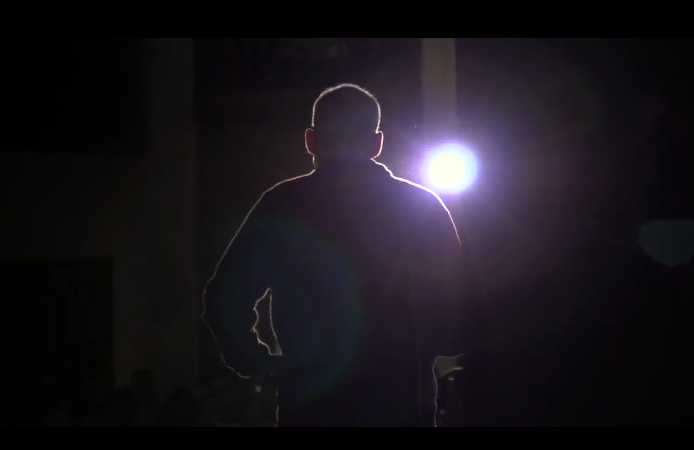
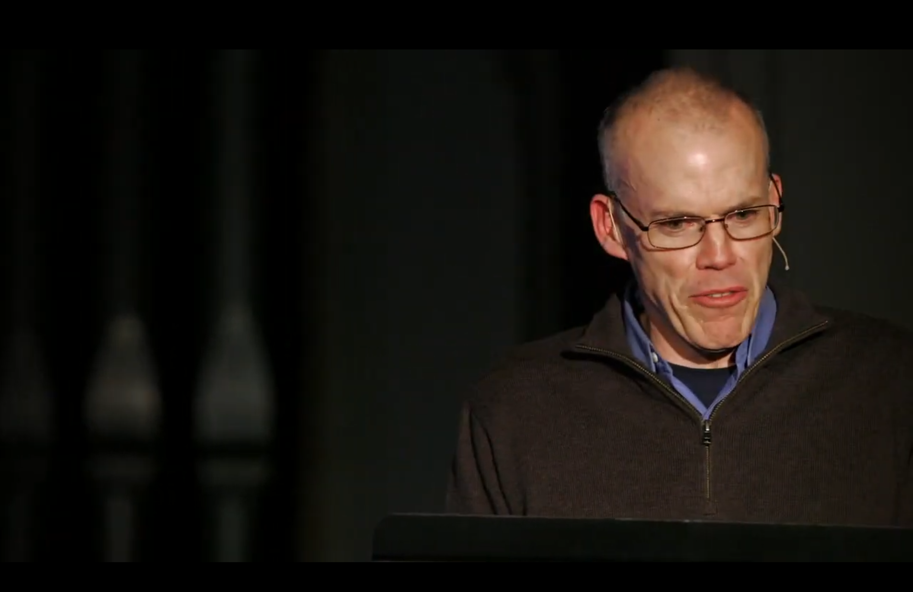
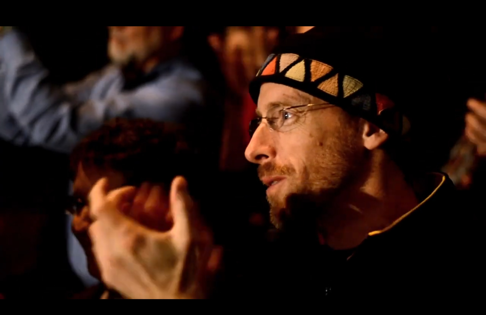

# Durchführung und Schritte
Teil der ersten Übung ist es mithilfe einer Tabelle erste, grobstrukturierte Annotationsdaten herzustellen. Dafür steht hier ein vorgesehenes Template bereit, in dem die zu analysierenden Parameter bereits festgelegt sind. Umfassende Informationen zu Parameterdefinitionen sowie Ansätze zur Segmentierung von Filmen und Bewegtbildern können in dem Kapitel [Weiterführende Informationen](../Kapitel_I/weiterführende_Informationen) eingesehen werden. 
## Segmentierung
In Bezug auf die Segmentierungslogik dient folgende Übersicht zur groben Orientierung:

### Die vier Grundeinheiten des Films

➝ **Sequenz**  
* Größte Einheit  
* Verbindet narrative oder formal-ästhetische Stränge miteinander  
* Zeitliche oder räumliche Kontinuität muss nicht gegeben sein (z. B. Parallelmontage, Rückblicke etc.)  
____________________
➝ **Szene**  
* Teilabschnitt eines Filmes  
* Folge von Einstellungen  
* Kontinuität von Raum, Zeit & Figuren ist gegeben, Abgeschlossener Bereich eines Films  
____________________
➝ **Einstellung**  
* Kleinste filmische Einheit  
* Ununterbrochene Aufnahme (ohne Schnitt)  
* Besteht aus mehreren Frames  
____________________
➝ **Frame**  
* Einzelbild  
* Für das menschliche Auge nicht bzw. kaum sichtbar  
* Bei analogem Material = 24 Bilder (Frames) pro Sekunde  

## Durchführung

*Ein Schritt-für-Schritt-Guide*

* Als erstes werden Basisparameter für die zu analysierenden Segmente festgelegt; die Auswahl der zu untersuchenden Basisparameter soll dazu dienen, die zentralen kompositorischen Einheiten filmischer Intensitäten und Bewegungen als deskriptive Analysemuster in einem ersten Schritt greifen zu können.

    ````{margin}
    ```{admonition} Kategorisierung von "Bildinhalt"
    :class: hinweis
    Des weiteren haben wir den Parameter "Bildinhalt" hinzugefügt und diesen wie folgt kategorisiert: 
    1. Bühne
    2. Publikum
    3. 2D-Animation
    4. Found Footage
    5. Interview
    
    Es können auch ausführlichere Beschreibungen eingetragen werden. Wir haben uns für eine allgemeine Kategorisierung entschieden.
    ```
    ````


Kurzdefinitionen zu unseren Basisparametern können haben wir hier zusammengefasst:
      
### Kurdefinition der ausgewählen Parameter

<ins>**Einstellungsgröße:** </ins> <br>
Größenverhältnis des abgebildeten Subjekts (Person)/Objekts zur Kadrage (Bildfeld)  
____________________
<ins>**Montage bzw. Schnitt:**</ins> <br> 
Verbindung der einzelnen Einstellungen zueinander, Zusammenfügung von Bild- und Toneinheiten  
____________________
<ins>**Kameraperspektive:**</ins> <br>   
Blickorientierung der Kamera auf ein Objekt/Subjekt oder das Geschehen  
____________________
<ins>**Kamerabewegung:**</ins> <br>
Alle Bewegungen, bei der die Kamera ihren Standort ändert  
____________________
<ins>**Ton:**</ins> <br>
Alle Geräusche, einschl. Musik, die im Offscreen oder Onscreen wahrnehmbar sind  
____________________
<ins>**Farbe:** </ins> <br>
Gestalterisches Ausdruckssystem, das Teil der Bildkomposition ist und die Beschaffenheit der Farben markiert  
____________________
<ins>**Licht:** </ins> <br>
Gestaltung der Hell-Dunkel-Kontraste sowie Lichtstärke 

```{admonition} Weiterführende Literatur zu Grundbegriffen
:class: seealso
Für eine vertiefende Beschäftigung mit den Grundbegriffen empfehlen wir folgende Internetseiten bzw. Lektüre: 
* <a href="https://filmanalyse.at/" class="external-link" target="_blank">Grundbegriffe Universität Wien</a>
* <a href="https://www.netzwerk-cinema.ch/uploads/files/Glossaire_reaseau_cinema_ch.pdf" class="external-link" target="_blank">Netzwerk Cinema CH</a>
*  Volker Pantenburg and Malte Hagener. Handbuch Filmanalyse. Springer, Wiesbaden, 2020. https://doi.org/10.1007/978-3-658-13339-9 {cite}`pantenburg2020`.
```

````{margin}
```{admonition} Szenen und Einstellungen
:class: caution
Bei ganzen Filmen ist es zunächst sinnvoller nach Sequenzen und/oder Szenen zu segmentieren. Einzelne Szenen wiederrum können dann in Einstellungen eingeteilt werden.
```
````

* Anschließend wird eine Segmentierungslogik, nach der der Videoclip analysiert werden soll, festgelegt. Wir haben uns, aufgrund der Länge des Gegenstandes, für eine Segmentierung in **Einstellungen** entschieden. 
* Sobald die Grundstruktur der zu analysierenden Einheiten steht, kann mit der tabellarischen Annotation begonnen werden, d.h., dass den Parametern Inhalte bzw. Werte beigeordnet werden, die aus der Inszenierung des Videos hervorgehen. Ein Template (als [Word-Datei](../assets/Tabellarische-Annotation-Template-Quadriga.docx) und [PDF](../assets/Tabellarische-Annotation-Template-Quadriga.pdf)) zum Ausfüllen des Einstellungsprotokolls kann hier heruntergeladen werden.

## Tabellarischer Auszug (Exemplar)
| Nr. | Dauer (sec.) | Screenshot                | Bildinhalt   | Einstellungsgröße  | Montage                     | Kamera                         | Ton/Musik                          | Farbe            | Licht        |
|-----|-------------:|---------------------------|--------------|--------------------|-----------------------------|--------------------------------|------------------------------------|------------------|--------------|
| 01  | 05''         |  | Bühne        | medium shot        | harter Schnitt              | low-angle; Fahrt: leicht>links | Dialog/Rede (onscreen)             | schwarz          | dunkel       |
| 02  | 07''         |  | 2D-Animation | closeup            | harter Schnitt              | high-angle; Fahrt: unten>oben  | Dialog/Rede /Gelächter (offscreen) | weiß, braun, rot | dunkel; hell |
| 03  | 04''         |  | Bühne        | medium closeup     | harter Schnitt              | straight-angle; unbewegt       | Dialog/Rede (onscreen)             | schwarz; grau    | dunkel       |
| 04  | 03''         |  | Publikum     | shoulder closeup   | harter Schnitt; Gegenschuss | straight-angle; unbewegt       | Applaus (onscreen)                 | orange; schwarz  | dunkel       |
| 05  | 03''         |  | Bühne        | medium closeup     | harter Schnitt; Gegenschuss | straight-angle; unbewegt       | Dialog/Rede (onscreen)             | schwarz; grau    | dunkel       |
```{admonition} Wichtig
:class: caution
Eine tabellarische Annotation erfordert viel Zeit und Aufmerksamkeit, da alle Daten, beispielsweise mit einem Textprogramm, manuell eingetragen werden müssen. 
```
## Schritte
Folgende Schritte sollen als Anweisung dienen, um die Durchführung der tabellarischen Annotation eigenständig reproduzieren zu können:
+++
1. *Segmentierung*: Das Video soll in diesem Schritt in die jeweiligen Einstellungen segmentiert werden
2. *Annotationsarbeit*: Die tabellarische Annotation kann beginnen, das Template kann vollständig ausgefüllt werden 
3. *Vergleichen*: Die Ergebnisse können mit der bereitgestellten Musterlösung verglichen werden
```{admonition} Achtung
:class: caution
Die Annotationen bzw. Annotationsmethode kann sich in einigen Punkten auch unterscheiden. Entscheidend ist, dass filmanalytische Daten in einem ersten Schritt erfasst und verglichen werden können.
```
Die Tabelle liegt ausgefüllt vor? 👏 Dann geht es zum nächsten Schritt ➡️ 
+++
Für einen Vergleich der Daten kann unsere [Musterlösung](../assets/Tabellarische-Annotation-Musterlösung-Quadriga.pdf) heruntergeladen werden.

## Literatur

```{bibliography}
:filter: docname in docnames
```