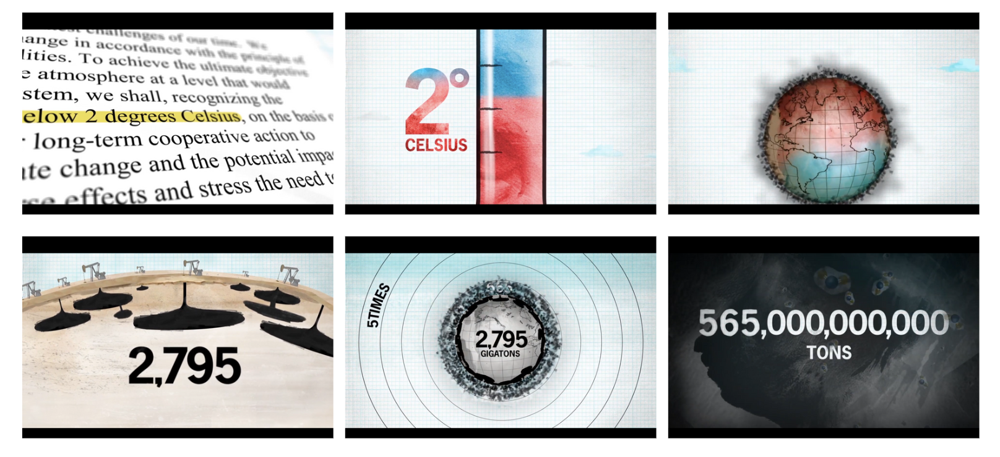
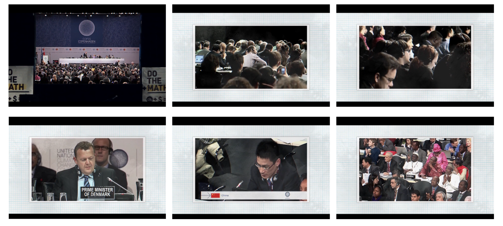

---
jupytext:
  formats: md:myst
  text_representation:
    extension: .md
    format_name: myst
kernelspec:
  display_name: Python 3
  language: python
  name: python3
---
```{code-cell} ipython3
:tags: [remove-cell]
from jupyterquiz import display_quiz

import sys
sys.path.append("..")
from quadriga_config import colors
```
# Übung, Ergebnisauswertung und Diskussion

Dieses Unterkapitel soll als Übung dazu dienen, die Ergebnisse aus der tabellarischen Annotation punktuell vergleichen und auswerten zu können.
Ebenso soll anhand der Auswertung der Ergebnisse diskutiert werden, welche Vor- und Nachteile sich aus dem Kontext der Übung für eine allgemeine Perspektive deskriptiver Methoden ableiten lassen.

## Frage 1

```{code-cell} ipython3
:tags: [remove-input]
display_quiz("../quizzes/A_UK-3_Quiz_1.json", colors = colors.jupyterquiz)
```

`````{admonition} Ausführliche Erläuterung der Antwort
:class: dropdown
Durch das Segmentieren in Dynamiken können ganz spezifische Verläufe, wie z.B. eine durchgehende musikalische Spur, die über die Dauer einer einzelnen Einstellung hinaus geht, annotiert werden. Da wir es bei diesem Beispiel mit einem kurzen Ausschnitt zu tun haben, ist eine Einteilung in Szenen weniger ergiebig.  
+++
Die nachfolgende Tabelle zeigt eine beispielhafte Segmentierungsstruktur. Hier wurde das Material nach ganz spezifischen Verläufen annotiert. Wichtig ist die Herausarbeitung repetitiver Strukturen und Dynamiken, wie z.B. das Spektrum von Lichtverhältnissen.

````{figure} ../assets/Verlaufsdynamik-Ausschnitt.png
:width: 1000px
:name: verlaufsdynamik

Annotation als Verlaufsdynamik (Ausschnitt)
````

```{attention} Bei einer (manuellen) tabellarischen Annotation gibt es keine Option, Visualisierungen automatisch generieren zu lassen. Hierfür müssen externe Programme oder Tools genutzt werden.
```
`````

## Frage 2

```{code-cell} ipython3
:tags: [remove-input]
display_quiz("../quizzes/A_UK-3_Quiz_2.json", colors = colors.jupyterquiz)
```

```{admonition} Ausführliche Erläuterung der Antwort
:class: dropdown
Um die Dauer einer Einstellung bei der tabellarischen Annotation zu erheben, können unterschiedliche Verfahren gewählt werden. Zum Beispiel kann eine Einstellung abgespielt und gleichzeitig eine Stoppuhr ⏰ eingesetzt werden. So kann ermittelt werden, welche Einstellungen die längste Dauer aufweisen. Da dieses Verfahren manuell durchgeführt werden muss, ist die Fehleranfälligkeit verhältnismäßig hoch.
+++
**Doch was sagt die Dauer der jeweiligen Einstellungen über die Einstellung selbst aus?**
+++
In unserem Videobeispiel ist die Dauer der Einstellungen für eine Analyse zeitlicher Relationen relevant. Die Einstellungen mit der längsten Dauer sind überwiegend welche, in denen eine 2D-Animation Sachverhalte simuliert. Die 2D-Animationen werden eingesetzt, um komplexe Prozesse und Relationen, die Einfluss auf den Klimawandel haben, bildlich greifbar zu machen und aus ihrer Abstraktion zu lösen.
Abstrakten Zahlen, wie zum Beipiel die kommunizierte 2 Grad-Grenze, werden affektive Bedeutungen ("Gefahr" oder "Bedrohung") beigemessen.



```

## Frage 3

````{margin}
```{hint} Als **Found Footage** wird Bildmaterial bezeichnet, das aus anderen medialen Kontexten stammt und wahrnehmbar aus den audiovisuellen Zusammenhängen eines Films heraussticht. 
Found Footage, also die Einbettung 'vorgefunden Materials', ist eine Gestaltungsmethode filmischer Inszenierung und kann auf vielfältige Weise eingesetzt werden.
```
````

```{code-cell} ipython3
:tags: [remove-input]
display_quiz("../quizzes/A_UK-3_Quiz_3.json", colors = colors.jupyterquiz)
```

```{admonition} Ausführliche Erläuterung der Antwort
:class: dropdown
Die Found Footage-Aufnahmen stammen von der 15. Klimakonferenz in Kopenhagen im Jahr 2009 der UNFCCC (15th Conference of the Parties to the United Nations Framework Convention on Climate Change). Durch die Einbindung dieses Videomaterials wird die historische wie auch politsche Dringlichkeit der Klimakrise als globales Problem klar herausgestellt. <br>
Hinsichtlich ihrer Gestaltung unterscheiden sich die Found Footage-Aufnahmen von den anderen Inszenierungsweisen des Films und bilden eine sich zur Tonebene synchron verhaltene Montagekette. <br>
Das Found Footage-Material wird in dem Videoausschnitt als Bild-in-Bild-Komposition eingebettet. Als Referenzobjekt für die Entfernung, beispielsweise für die Bestimmung von Einstellungsgrößen, können hier entweder die Menschen und/oder das gesamte Arrangement (inkl. der umgebenden Rahmung) gesetzt werden.



```

## Diskussion: Vor- und Nachteile

Welche Vor- und Nachteile ergeben sich aus der bisherigen Arbeit mit der Methode der tabellarischen Annotation?

| Vorteile                                                                                       | Nachteile                                              |
|------------------------------------------------------------------------------------------------|--------------------------------------------------------------------------------------------------------------------|
| Einfache Handhabung | Kein einheitliches Vokabular oder eine einheitliche Form, die bestimmte Inhalte und Werte als Input vorformuliert hat |
| Gute Zugänglichkeit                                                                            | Annotationsanpassungen unterliegen den je eigenen Entscheidungen, d.h., dass Ergebnisse unterschiedlich ausfallen können |
| Für Erstellung grober Datenstrukturen ein unkompliziertes Verfahren                            | Keine Grundlage für analytische Vergleiche                                                                         |
| Für individuelle Zwecke jederzeit anpassbar                                                    | Player und Dokument sind getrennt                                                                                  |
| Leichter Einstieg in Methoden deskriptiver Filmanalyse                                         | Auswertung der Daten nur punktuell möglich                                                                         |
|                                                                                                | Visualisierung mit externen Tools                                                                                  |
|                                                                                                | Erhebung und Ermittlung von Einstellungsdauern sehr aufwendig und unpräzise                                        |
|                                                                                                | Kein Export der Daten möglich                                                                                      |
|                                                                                                | Keine Maschinenlesbarkeit                                                                                          |

Die tabellarische Annotation ist für einen Einstieg in Methoden deskriptiver Analyse gut geeignet. Sie kann die Arbeit am Filmmaterial sinnvoll ergänzen sowie im Kontext wissenschaftlicher Arbeiten eingesetzt werden, um auf konkrete analytische Beschreibungen verweisen zu können. Insofern ist die tabellarische Annotation ein einfaches Hilfsmittel.
+++
Wie gezeigt werden konnte, gibt es zwar Möglichkeiten manuelle Annotationen ebenfalls als Verlaufsdynamiken zu visualisieren (Tools für Tabellen, Bildbearbeitungsprogramme o.Ä.), jedoch gibt es keine Exportmöglichkeiten für solche Visualisierungen. Da es keine festgelegte Annotationstaxonomie gibt, fehlt hier auch eine Grundlage für filmübergreifende Vergleiche. Ebenso ist das Moment der zeitlichen Beschaffenheit des Materials schwer einzuholen. Dies ist dem Umstand der Trennung von Player und Dokument geschuldet, denn es gibt keine 'synchrone' Annotationsmöglichkeit durch das Fehlen der Einbindung des Videos und der Einbettung einer Timeline. Die Auswertung der Daten erfolgt, wie wir es hier durch die Abfrage von Ergebnissen und Quantitäten versucht haben zu reproduzieren, nur punktuell. Eine maschinenlesbare Produktion der Daten als visuelle Verlaufsdynamik ist nicht möglich.
