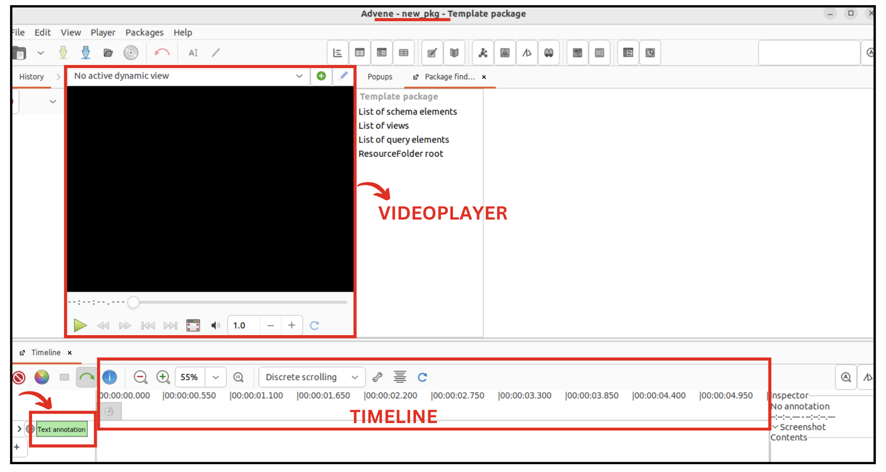
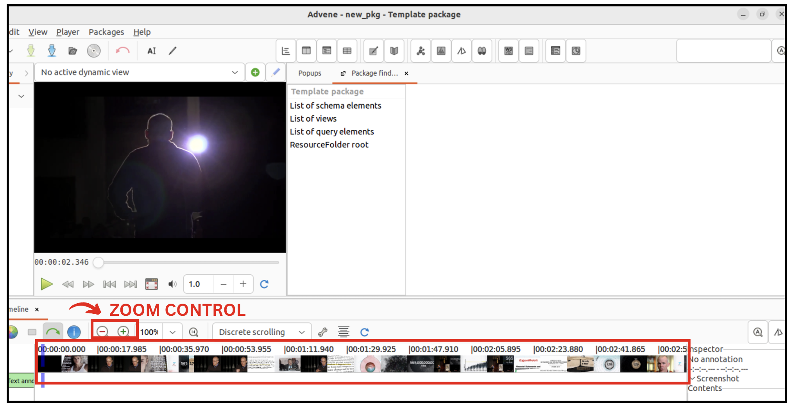
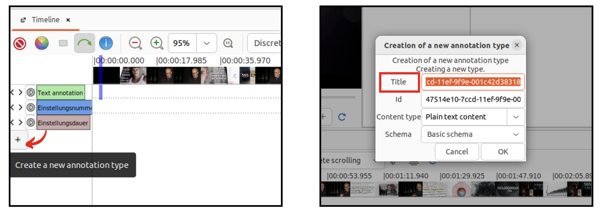
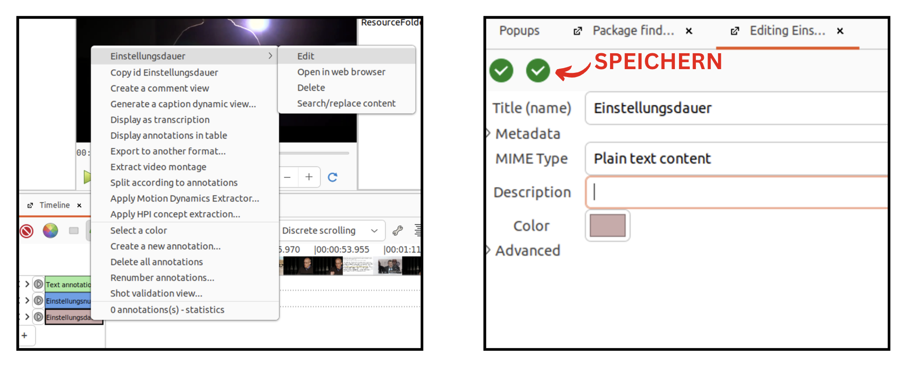
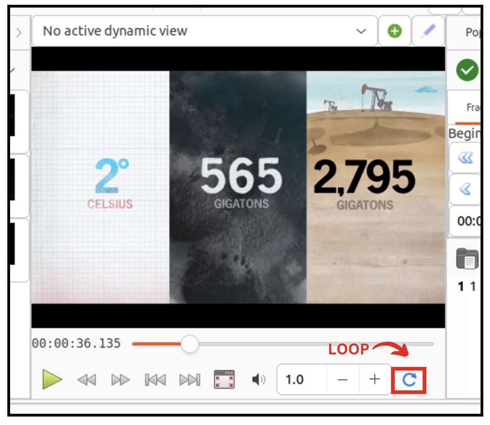
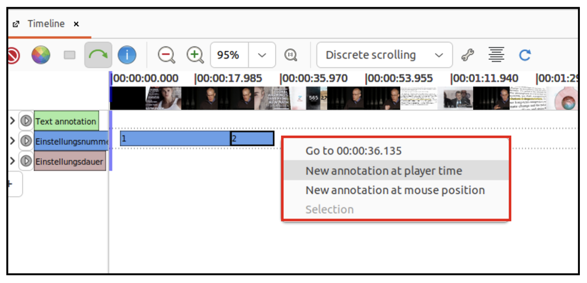
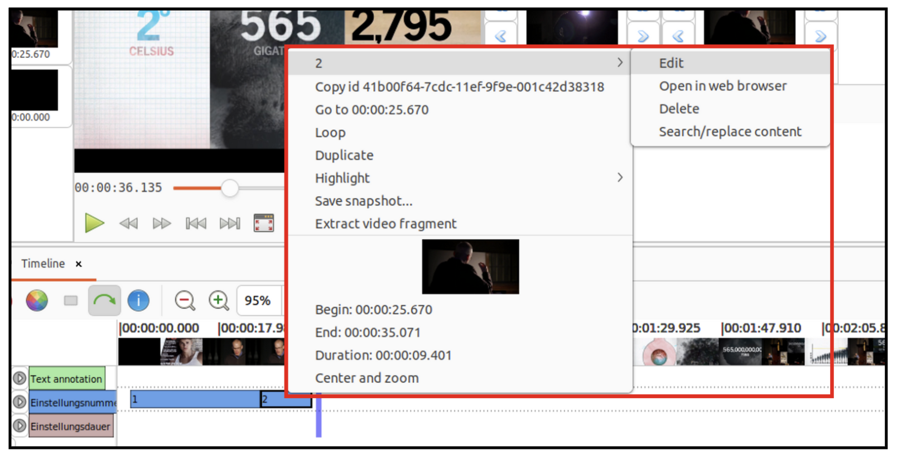

---
jupytext:
  formats: md:myst
  text_representation:
    extension: .md
    format_name: myst
kernelspec:
  display_name: Python 3
  language: python
  name: python3
---
```{code-cell} ipython3
:tags: [remove-cell]
from jupyterquiz import display_quiz

import sys
sys.path.append("..")
from quadriga import colors
```

# Annotieren mit Advene 

Für detailreiche Erklärungen zu der Bedienung von Advene stehen <a href="https://github.com/oaubert/advene/wiki/AdveneUserGuide" class="external-link" target="_blank">hier</a> sowie <a href="https://www.advene.org/screencasts.html#screencasts" class="external-link" target="_blank">hier</a> Userguides zur Verfügung, in denen die wesentlichen Funktionen und Optionen von Advene erklärt werden.

Die für *unseren* Workflow wichtigen Funktionen sollen im Folgenden in einem Schritt-für-Schritt Guide reproduziert und nachvollzogen werden.

## Einrichtung, Bedienung und Interface

Wird die Anwendung gestartet, öffnet sich automatisch ein leeres Template bzw. ein Paket, das als advenespezifische **.azp**-Datei gespeichert werden kann. Das Paket (Package) enthält zunächst ein einfaches **'simple text'** Schema (mit dem Wert: `text/plain`), mit dem wir in dieser Übung arbeiten werden. 
````{margin}
```{admonition} Was ist ein MIME Type?
:class: seealso
Ein **MIME Type** (Multipurpose Internet Mail Extensions) ist ein Standardformat im Internet, um den Dateityp und den Inhalt einer Datei anzugeben und kann als ein allgemeines Konzept für die Typisierung von Datenformaten beschrieben werden. MIME Types bestehen aus einem Haupttyp (z.B. "text" oder "image") und einem Subtyp (z.B. "html", "jpeg"), die durch einen Schrägstrich voneinander getrennt sind: z.B. "text/html" für eine HTML-Datei oder "image/jpeg" für ein JPEG-Bild.
```
````
```{admonition} Content bzw. MIME Types für Annotationstypen
:class: hinweis
Andere Schemata bzw. Content Types/MIME Types, wie z.B. `JSON data` oder `Keyword list`, stehen ebenfalls zur Verfügung. Unter "Annotation Types" im <a href="https://github.com/oaubert/advene/wiki/AdveneUserGuide" class="external-link" target="_blank">Userguide</a> finden sich ausführliche Informationen zu den einzelnen Typen.
```
Im Zentrum der Anwendung ist ein Videoplayer sowie eine Timeline zu sehen. Am linken Rand erscheinen die Annotationstypen (in unserem Fall werden es die einzelnen zu analysierenden Parameter sein). 
+++

+++
In einem separaten Schritt wird nun unsere Videodatei mit dem Package verknüpft. Dafür unter dem Reiter 'File' die Option 'Associate a video file' auswählen. 
+++
Mit der Verknüpfung von Video und Package sieht man nun in der Timeline den Verlauf der Videodatei mit Einzelbildern. Die Timeline ist nur eine von mehreren sogenannten Views, also Ansichten, mit der gearbeitet werden kann. Weitere Ansichtsübersichten können ebenfalls hinzugefügt und nach eigenen Wünschen angeordnet werden. Jede View entspricht einer anderen Darstellungs- oder Visualisierungsform für Annotationen.
+++
Mit 'zoom in' bzw. 'zoom out' kann die Ansichtsgröße der Timeline angepasst und nach eigenen Belieben skaliert werden. 
+++

+++
Das Video ist nun mit Advene als ein **.azp-package** verknüpft! 👍 <br>
Wie man Annotationstypen (also unsere Parameter) sowie Annotationen hinzufügt, erklären wir im nächsten Schritt.

## Annotationstypen und Annotationen
### Hinzufügen und bearbeiten der ausgewählten Parameter

Mit einem Klick auf das Plus-Symbol am linken Rand der Timeline können nun unsere Parameter bzw. Annotationstypen erstellt werden. Jeder Annotationstyp hat einen 'Title', eine 'Id', einen 'Content type' sowie ein zugeordnetes 'Schema'. Da wir hier mit dem voreingestellten **MIME Type** `plain text content` arbeiten, muss nur das Feld 'Title' bearbeitet werden. 
+++

+++
Nun erscheint der neu erstellte Annotationstyp. Um diesen zu bearbeiten, beispielsweise zur Anpassung der Farbe, können mit einem Rechtsklick auf den Typen Änderungen vorgenommen werden. Änderungen im Edit-Fenster müssen immer bestätigt werden.
```{admonition} Hinweis
:class: hinweis
Bestimmungen im Register 'Advanced' können für diese Annotationsübung erstmal ignoriert werden. 
```

+++
Die Annotationstypen können mit einem Klick auf den bunten Kreis nach Belieben ein- und ausgeblendet werden. 
```{image} ../assets/_images/A2-S05.png
:align: center
:height: 450px
:name: a2-s05
```
(Segmentierung-Annotation)=
### Annotationen erstellen 

Nun geht es darum, die Annotationen für die erstellten Parameter/Typen zu erstellen. Doch nach welcher Segmentierungslogik sollen die Annotationen erstellt werden?
+++
In der Übung [Tabellarische Annotation](Aufgabe_A) haben wir zunächst jeden Parameter je Einstellung annotiert. Dort haben wir aber festgestellt, dass diese Form der Segmentierung nicht immer sinnvoll ist, insbesondere dann, wenn man Verläufe und Dynamiken herausarbeiten möchte (s. hierfür auch [Fig. 2.1](#verlaufsdynamik)).

```{code-cell} ipython3
:tags: [remove-input]
display_quiz("../quizzes/B_UK-1_Quiz_1.json", colors = colors.jupyterquiz)
```

```{admonition} Antwort
:class: solution, dropdown
Die Typen **Dauer**, **Einstellungsgröße**, **Montage** (hier annotieren wir die Form des Übergangs), **Kameraperspektive** sowie **Kamerabewegung** annotieren wir zunächst Einstellung für Einstellung, denn hier ist es wichtig, die Relationen, Wiederholungen und Veränderungen von Einstellung zu Einstellung sichtbar zu machen. Die Typen **Bildinhalt**, **Musik**, **Dialog**, **Licht** sowie **Farbe** werden nach ihren je spezifischen Verläufen annotiert. 
```

````{margin}
```{admonition} Tipp
:class: hinweis
Mit der Loop-Taste am rechten unteren Rand des Videoplayers werden angelegte Annotationen im Loop abgespielt.

```
````
Nachdem die Festlegung auf eine Segmentierungsmethode steht, können die Annotationen erstellt werden. Um eine neue Annotation zu erstellen, einfach mit der rechten Maustaste in die gewünschte Spur klicken und 'New annotation at mouse position' oder 'New annotation at player time' auswählen – abhängig davon, ob die neue Annotation nach der Position des Mauszeigers oder anhand des aktuellen Videoplayer-Timecodes erstellt werden soll (letzteres ist natürlich immer präziser). Danach wird der erstellten Annotation durch Freitexteingabe ein Inhalt zugeordnet. Hierzu mit dem Mauszeiger auf die gewünschte Annotation (diese wird durch einen schwarzen Balken umrandet) und mit 'Enter' das Textfeld öffnen. Erneut durch 'Enter' das Textfeld schließen.

Falls eine Annotation auf einer nicht erwünschten Timelineposition erstellt wird, kann diese folgendermaßen angepasst werden: entweder durch Ausrichtung der Annotationsgrenze per Drag and Drop an einer anderen Annotation der Spur (die sogenannte 'align'-Funktion) oder durch die einzelne Bearbeitung der Anfangs- und Endzeit der Annotation (im Edit-Fenster). Zur Bearbeitung der Annotation im Edit-Fenster mit einem Rechtsklick auf die Annotation und dann auf 'Edit'.

```{admonition} Achtung
:class: caution
Es empfiehlt sich schon während der Annotation die Datei zu speichern, um mögliche Verluste zu vermeiden. Hier unter dem Reiter 'File' auf 'Save as…'
klicken und die Datei benennen sowie abspeichern. 
```
Darüber hinaus können Annotationen aus einer Spur kopiert und gelöscht sowie in andere Spuren kopiert oder verschoben werden. 


`````{admonition} Wofür kann diese Funktion sinnvoll sein?
:class: exercise
````{admonition} Antwort
:class: solution, dropdown
Da wir bei einigen Typen je Einstellung annotieren, müssen wir natürlich nicht jedes Mal die Einstellungsgrenzen neu setzen. Hierfür reicht es, wenn wir die Annotationssegmentierung des Annotationstypen **Einstellungsnummer** in jene andere Typen kopieren, die wir auch nach diesem Schema annotieren möchten. 
````
`````

````{margin}
```{admonition} Tipp
:class: hinweis
Wer die tabellarische Annotation bereits vollständig erarbeitet hat, kann natürlich die Daten aus der ersten Tabelle übernehmen und beim Annotieren eintragen. 
```
````

````{margin}
```{admonition} Achtung
:class: caution
Jedes neue Package enthält bereits eine standardisiert eingestellte Annotationsspur ('text annotation'). Diese ggf. im Vorfeld löschen!
```
````

```{admonition} Übungsaufgabe
:class: exercise
<span style="color:purple">**Ziel**</span>:
In dieser Übung sollen Sie sich mit den Funktionsweisen des Annotationstools Advene vertraut machen und anschließend ein Annotationspaket mit filmanalytischen Metadaten auf Basis von Freitextannotationen erstellen.

<span style="color:purple">**Aufgabe**</span>:
1. Advene starten und Videodatei verknüpfen
2. Annotationstypen erstellen 
3. Als nächstes können nun die Annotationen auf der Timeline erstellt werden. Wer sehr präzise Annotationsgrenzen haben möchte, kann über die Frametaste in der Wiedergabesteuerung Annotationsabschnitte erstellen und anpassen
4. Überprüfen und Annotationen ggf. nachbearbeiten
5. Für die Weiterverarbeitung der Daten das Paket in ein Zielformat exportieren
6. Ist das Paket vollständig ausgefüllt? Dann können die Ergebnisse mit unserer [Musterlösung](../assets/QUADRIGA-Advene-A2-Annotationspaket.azp) verglichen werden. 

<span style="color:purple">**Bearbeitungszeit**</span>: Ca. 120-180 Min.
```

Als nächstes wiederholen wir die Annotationsarbeit mit einem anderen Tool – und zwar ELAN. Dieser Schritt soll insbesondere dazu dienen, toolagnostische Perspektiven für Datenanalysen zu veranschaulichen. 