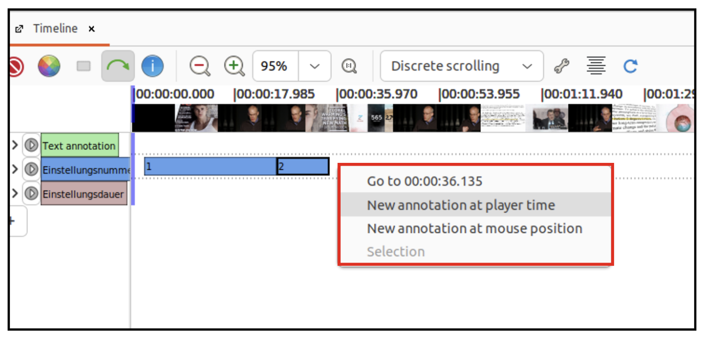
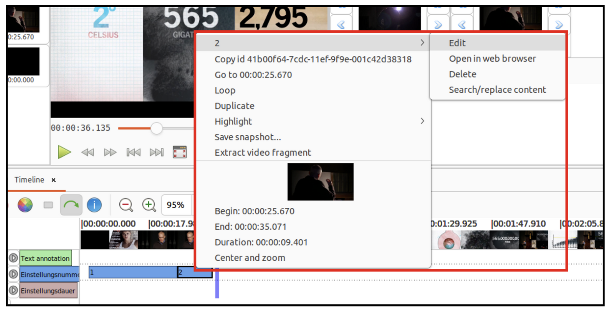

# *Advene*: Annotationstypen und Annotationen
## Hinzufügen und bearbeiten der ausgewählten Parameter

````{margin}
```{admonition} Was ist ein MIME Type?
Ein **MIME Type** (Multipurpose Internet Mail Extensions) ist ein Standardformat im Internet, um den Dateityp und den Inhalt einer Datei anzugeben. Er besteht aus einem Haupttyp (z.B. "text" oder "image") und einem Subtyp (z.B. "html", "jpeg"), die durch einen Schrägstrich voneinander getrennt sind: z.B. "text/html" für eine HTML-Datei oder "image/jpeg" für ein JPEG-Bild.
```
````
Mit einem Klick auf das Plus-Symbol am linken Rand der Timeline können nun unsere Parameter bzw. Annotationstypen erstellt werden. Jeder Annotationstyp hat einen 'Title', eine 'Id', einen 'Content type' sowie ein zugeordnetes 'Schema'. Da wir hier mit dem voreingestellten **MIME Type** `plain text content` arbeiten, muss nur das Feld 'Title' bearbeitet werden. 
+++

+++
Nun erscheint der neu erstellte Annotationstyp. Um diesen zu bearbeiten, beispielsweise zur Anpassung der Farbe, können mit einem Rechtsklick auf den Typen Änderungen vorgenommen werden. Änderungen im Edit-Fenster müssen immer bestätigt werden.
```{hint}
Bestimmungen im Register 'Advanced' können für diese Annotationsübung erstmal ignoriert werden. 
```

+++
Die Annotationstypen können mit einem Klick auf den bunten Kreis nach Belieben ein- und ausgeblendet werden. 
```{image} ../_images/A2-S05.png
:align: center
:height: 450px
:name: a2-s05
```
## Annotationen erstellen 

Nun geht es darum, die Annotationen für die erstellten Parameter/Typen zu erstellen. Doch nach welcher Segmentierungslogik sollen die Annotationen erstellt werden?
+++
In der Übung [Tabellarische Annotation](Aufgabe_A) haben wir zunächst jeden Parameter je Einstellung annotiert. Dort haben wir aber festgestellt, dass diese Form der Segmentierung nicht immer sinnvoll ist, insbesondere dann, wenn man Verläufe und Dynamiken herausarbeiten möchte (s. hierfür auch [Fig. 4](#verlaufsdynamik)).
+++
*Welche Annotationstypen können nach welcher Logik folglich annotiert werden?* QUIZ EINBINDEN
:::{dropdown} Antwort
Die Typen **Einstellungsnummer**, **Dauer**, **Einstellungsgröße**, **Montage**, **Kameraperspektive**, **Kamerabewegung** sowie **Farbe** annotieren wir zunächst Einstellung für Einstellung, denn hier ist es wichtig, die Relationen, Wiederholungen und Veränderungen von Einstellung zu Einstellung sichtbar zu machen. Die Typen **Setting**, **Musik**, **Dialog** sowie **Licht** werden nach ihren je spezifischen Verläufen annotiert. 
:::
````{margin}
```{hint} 
Mit der Loop-Taste am rechten unteren Rand des Videoplayers werden angelegte Annotationen im Loop abgespielt.

```
````
Um eine neue Annotation zu erstellen, einfach mit der rechten Maustaste in die gewünschte Spur klicken und 'New annotation at mouse position' oder 'New annotation at player time' auswählen – abhängig davon, ob die neue Annotation nach der Position des Mauszeigers oder anhand des aktuellen Videoplayer-Timecodes erstellt werden soll (letzteres ist natürlich immer präziser). Danach wird der erstellten Annotation durch Freitexteingabe ein Inhalt zugeordnet. Hierzu mit dem Mauszeiger auf die gewünschte Annotation (diese wird durch einen schwarzen Balken umrandet) und mit 'Enter' das Textfeld öffnen. Erneut durch 'Enter' das Textfeld schließen.

Falls eine Annotation auf einer nicht erwünschten Timelineposition erstellt wird, kann diese folgendermaßen angepasst werden: entweder durch Ausrichtung der Annotationsgrenze per Drag and Drop an einer anderen Annotation der Spur (die sogenannte 'align'-Funktion) oder durch die einzelne Bearbeitung der Anfangs- und Endzeit der Annotation (im Edit-Fenster). Zur Bearbeitung der Annotation im Edit-Fenster mit einem Rechtsklick auf die Annotation und dann auf 'Edit'.

```{attention} 
Es empfiehlt sich schon während der Annotation die Datei zu speichern, um mögliche Verluste zu vermeiden. Hier unter dem Reiter 'File' auf 'Save as…'
klicken und die Datei benennen sowie abspeichern. 
```
Darüber hinaus können Annotationen aus einer Spur kopiert und gelöscht sowie in andere Spuren kopiert oder verschoben werden. *Wofür kann diese Funktion sinnvoll sein?*
:::{dropdown} Antwort
Da wir bei einigen Typen je Einstellung annotieren, müssen wir natürlich nicht jedes Mal die Einstellungsgrenzen neu setzen. Hierfür reicht es, wenn wir die Annotationssegmentierung des Annotationstypen **Einstellungsnummer** in jene andere Typen kopieren, die wir auch nach diesem Schema annotieren möchten. 
:::
```{hint} 
Wer die tabellarische Annotation bereits vollständig erarbeitet hat, kann natürlich die Daten aus der ersten Tabelle übernehmen und beim Annotieren eintragen. 
```
Ist das Paket vollständig ausgefüllt? Dann können die Ergebnisse mit unserer Musterlösung vergleichen werden. 
+++
Als nächstes wiederholen wir die Annotationsarbeit mit einem anderen Tool – und zwar ELAN. Dieser Schritt soll insbesondere dazu dienen, toolagnostische Perspektiven für Datenanalysen zu veranschaulichen. 