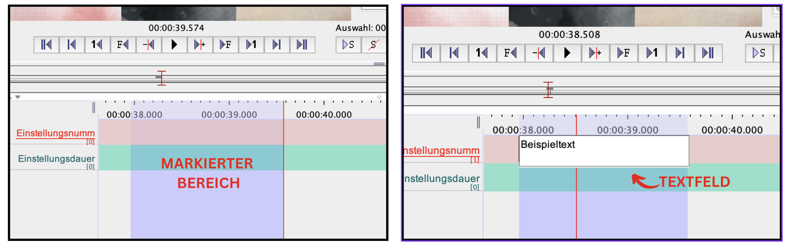
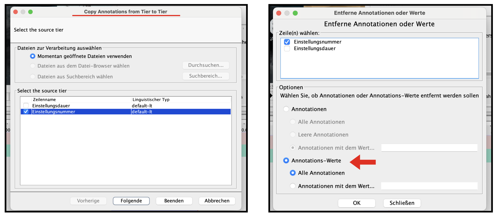

---
jupytext:
  formats: md:myst
  text_representation:
    extension: .md
    format_name: myst
kernelspec:
  display_name: Python 3
  language: python
  name: python3
---
```{code-cell} ipython3
:tags: [remove-cell]
from jupyterquiz import display_quiz

import sys
sys.path.append("..")
from quadriga_config import colors
```

# Annotieren mit ELAN
In diesem Unterkapitel soll das Annotationstool ELAN vorgestellt sowie die wesentlichen Funktionen und Bedienungsweisen kurz und übersichtlich umrissen werden. Umfassende Anleitungen aller Grundfunktionen im Detail können unter "Documentation" auf der <a href="https://archive.mpi.nl/tla/elan" class="external-link" target="_blank">Seite des Entwicklers</a> aufgerufen werden. Ein Quick Guide vom Entwickler <a href="https://www.mpi.nl/" class="external-link" target="_blank">Max Planck Institute for Psycholinguistics</a> kann <a href="https://www.mpi.nl/tools/elan/docs/How-to-pages_9.pdf" class="external-link" target="_blank">hier</a> eingesehen werden.
+++
ELAN (Eudico Linguistik Annotator) ist eine Open Source Transkriptions- und Annotationssoftware für Mediendateien mit Schwerpunkt Video. Entwickelt wurde die Software vom Max Planck Institute for Psycholinguistics. ELAN kennzeichnet sich insbesondere durch die Möglichkeit der Herstellung multimodaler Annotationen aus, wie zum Beispiel durch simultane Annotationsarbeiten an Bild und Ton. 
+++
Ähnlich wie in Advene, können in ELAN ebenfalls Annotationen auf einer Timeline angefertigt werden. Durch verschiedene Exportmöglichkeiten in andere Formate (wie z.B. als **CSV**-Datei) können die Annotationsergebnisse für Präsentationen und andere Projekte genutzt werden.

## Interface, Bedienung und Einrichtung

````{margin}
```{important} 
Die Videodatei ist erstmal undefiniert. Um Sicherheitskopien erstellen zu können, muss die Datei (im elanspezifischen **.eaf**-Format) gespeichert werden. Hierzu unter 'Datei > Speichern unter…' die Datei benennen und speichern. Anschließend ebenfalls unter 'Datei' die automatische Sicherheitskopie aktivieren.
```
````
Wird die Anwendung gestartet öffnet sich zunächst ein blankes Interface. In der Menüleiste am oberen Rand kann die Videodatei, die annotiert werden soll, über den Reiter 'Datei' und 'Neu' hinzugefügt werden.
```{image} ../_images/A2-S09.png
:align: center
:height: 400px
:name: a2-s09
```
Sobald die Datei verknüpft ist, erscheint die Annotationsoberfläche. Unter der Videoanzeige ist eine **Wiedergabesteuerung** zu sehen. Die Steuerung kann über die Scroll,- Pixel,- Frame-, oder Sekundentasten vorgenommen werden. 
+++
Der **Auswahlsteuerung** neben der Wiedergabesteuerung kann angepasst werden. Folgende Optionen (der Reihenfolge nach) sind möglich: <br>
1. Ausgewählter Bereich wird abgespielt
2. Auswahl wird aufgehoben
3. Fadenkreuz bewegt sich an den Anfang oder an das Ende des markierten Bereichs
4. Der Cursor springt zur vorigen/nächsten oder drüber/drunterliegenden Annotation
5. 'Auswahl-Modus aktivieren': Bereich wird bei Wiedergabe oder vorwärt/rückwärts-Bewegung markiert
+++
Der **Schleifenmodus** spielt den ausgewählten Bereich im Loop ab.
+++
Die **Navigation der Timeline** erfolgt durch den grauen Balken unter der Wiedergabe- und Auswahlsteuerung. Die Leiste stellt den gesamten Filmverlauf dar. Durch Klicken in die Zeile springt der Zeiger an die entsprechende Stelle. 
+++
Die **Größenskalierung** der Timeline erfolgt über den Regler am unteren rechten Rand.
+++
Im Fenster rechts neben dem Videoplayer kann unter 'Steuerung' die Wiedergabegeschwindigkeit des Videos angepasst werden. 

+++

`````{admonition} In welchen Fällen ist die Regulierung der Wiedergabegeschwindigkeit sinnvoll?
:class: tip
````{admonition} Antwort
:class: dropdown
Manchmal kann es sehr nützlich sein, die Wiedergabegeschwindigkeit an den eigenen **Annotationsrhythmus** anzupassen. Einige Einstellungen können als sehr schnell wahrgenommen werden. Die Reduzierung der Geschwindigkeit kann helfen, dass jene Bildinhalte, die man als Werte in den Annotationen anlegen möchte, auch tatsächlich präzise erfasst werden. 
````
`````

Solbald das Video mit dem ELAN-Projekt verknüpft ist, können Annotationszeilen – "Tiers" gennant – sowie Annotationen angelegt werden. 
# Annotationszeilen (Tiers) und Annotationen
## Zeilen
Eine 'default'-Zeile wird automatisch bei jedem neuen Annotationsdokument angelegt. Diese kann im Vorfeld entweder umbenannt oder gelöscht werden. 
+++
````{margin}
```{attention} 
Beim Schließen des Bearbeitungsfensters ohne die Einfügung der Zeile wird die Zeile nicht gespeichert.
```
````
Um eine neue Zeile bzw. "Tier" anzulegen, im Menüpunkt auf 'Zeile > Neue Zeile einfügen…' klicken. Das sich öffnende Bearbeitungsfenster ermöglicht die Benennung der Zeile. Weitere Attribute (wie z.B. "Teilnehmer" oder "Annotator") können ebenfalls ergänzt werden. Um die Zeile zu speichern, auf 'Einfügen' klicken. 
```{image} ../_images/A2-S11.png
:align: center
:height: 500px
:name: a2-s11
```
````{hint} 
Die Farben des Zeilentitels sowie der Zeilenleiste selbst können nach eigenen Belieben angepasst werden. Hierzu im Fenster der Zeileneigenschaften 'Weitere Optionen' wählen. 
```{image} ../_images/A2-S12.png
:align: center
:height: 250px
:name: a2-s12
```
````
## Erstellen von Templates

Mit Elan ist es möglich Annotationsprojekte als Templates zu sichern. Die Erstellung eines Templates empfiehlt sich insbesondere, wenn für mehrere Filme oder Filmausschnitte Annotationen mit dem gleichen Set an Parametern erstellt werden sollen. Hierzu können Basisspuren, also Annotationszeilen, vordefiniert und anschließend die Datei als Vorlage gesichert werden. 
+++
Um ein Template zu erstellen, einfach vorgehen wie beim Start eines regulären Annotationsprojektes. Anschließend die Zeilen erstellen und die Datei unter 'Speichern als Vorlage' im **.etf-Format** sichern.
+++
Zur Nutzung der Vorlage ELAN starten und unter 'Datei > Neu…' die Vorlagedatei wählen und öffnen.

## Annotationen

Annotationen werden als Zeitsegmente entlang der Timeline angelegt. Es gibt die Möglichkeit Annotationen A) **"frei Hand"** zu erstellen oder B) **präzisere Zeitabschnitte** durch beispielswseise die Frame- und Pixeltaste anzulegen.
+++
### Variante A
Der schnellste Weg eine Annotation zu erstellen ist mit dem Zeiger in das Feld der Annotationen an die Zeitstelle zu klicken, an der es losgehen soll, gedrückt halten und den Zeiger bis zum gewünschten Ende ziehen (geht vorwärts wie rückwärts). Der markierte Bereich erscheint violett. Mit einem Doppelklick in die gewünschte Zeile kann der Annotation ein Inhalt bzw. Wert beigeordnet werden. Zum Speichern 'Enter' drücken.
+++

+++
Jetzt kann man entweder…:
* …diese Auswahl aufheben (durchgestrichenes S im Auswahl-Modus) bzw. an anderer Stelle eine neue Auswahl erstellen
* …im gleichen Auswahlbereich in eine andere Zeile mit Doppelklick eine weitere Annotation hinzufügen,
* …in dieselbe Annotation durch Doppelklick wieder neuen Text hinzuschreiben, den Text verändern (dies geht natürlich jederzeit)

### Variante B

Wer präzise Annotationen erstellen möchte, kann mit der Bedienung der Wiedergabesteuerung arbeiten. Hierfür ist es wichtig, dass unter dem Medienfenster die Zeitanzeige auf Frames eingestellt ist. Mit einem Rechtsklick auf die Zeitanzeige kann das Ausgabeformat geändert werden. Abhängig von der **Frame Rate** des Videos "PAL" oder "NTSC" wählen. 
Zur Erstellung der Annotation dann an den ungefähren Bereich des Anfangs navigieren und mit der Frametaste bzw. Pixeltaste den genauen Anfang bestimmen. Dann den 'Auswahl-Modus' aktivieren und erneut mit der Frametaste/Pixeltaste zur Endzeit der Annotation steuern. Den 'Auswahl-Modus' deaktivieren und mit einem Doppelklick die Annotation erstellen bzw. einen Wert einfügen. 
```{admonition} Was ist "PAL" oder "NTSC"?
Die Zeitformate **PAL** oder **NTSC** beziehen sich auf die Bildfrequenz – also Frame Rate. PAL-Videos werden üblicherweise mit einer Frame Rate von 25 Bildern pro Sekunde (FPS = frames per second) aufgenommen während NTSC mit einer Frame Rate von 30 Bildern pro Sekunde arbeitet. <br>
Die Frame Rate eines Videos kann über gängige Videoabspielprogramme herausgefunden werden. Hierzu die Metadateninformationen abrufen: 
Beispielsweise unter VLC im Abspielmodus mit cmd + I (Mac)  bzw. Strg + J (Windows) und dann unter 'Codecdetails > Bildwiederholrate'.
```

```{code-cell} ipython3
:tags: [remove-input]
display_quiz("../quizzes/B_UK-2_Quiz_1.json", colors = colors.jupyterquiz)
```

### Annotationen bearbeiten 

Bereits angelegte Annotationen können ganz einfach geändert werden. Der Annotationsinhalt kann am schnellsten über einen Doppelklick auf die Annotation bearbeitet werden. Weitere Optionen können anschließend mit einem Rechtsklick aufgerufen werden. Hier die wichtigsten kurz erklärt:

* 'Annotationswert ändern' = der Inhalt der Annotation kann bearbeitet werden
* Annotation aufteilen' = die Annotation wird am Punkt des Mausanzeigers aufgeteilt
````{margin}
```{note}
Das Löschen von Annotationen oder Zeilen kann über die obere Menüleiste unter 'Bearbeiten' rückgängig gemacht werden.
```
````
* Zusammenfügen mit der vorigen oder nächsten Annotation' = Annotationen können "gemerged", also zu einer Annotation verbunden werden
* 'Annotationswert löschen' = der Inhalt der Annotation wird gelöscht
* 'Annotation löschen' = die gesamte Annotation wird gelöscht 
+++
Fertige Annotationen können auch a) bewegt oder b) in ihrer Länge verändert werden, indem man die 'ALT' (Windows) bzw. 'Option-Taste' (Mac) gedrückt haltend auf den Strich klickt (wechselt zu grün). Anschließend zum a) Verschieben die Annotation entlang der Zeitleiste bewegen, um die Position zu verändern oder b) am Ende der Annotation an der Zeitmarke vorwärts oder rückwärts bewegen.
+++

+++
### Kopieren und Löschen von Annotationen und Werten

Parameter, also Annotationszeilen, die zum Beispiel nach dem Einstellungsprinzip annotiert werden, können auch auf eine andere Zeile kopiert werden. Dafür unter dem Reiter 'Zeile' auf 'Copy Annotations from Tier to Tier' klicken. In dem sich öffnenden Bearbeitungsfenster kann dann die Zeile ausgewählt werden, aus der die Annotationen kopiert werden sollen. Anschließend kann die Zielzeile ausgewählt werden. Mit 'Beenden' werden die Änderungen übernommen.
+++
Zum Löschen der Werte über 'Zeile' auf 'Entferne Annotationen oder Werte' klicken und alle (oder ausgewählte) Werte für die gewünschte Zeile löschen. So können neue Werte in der Zielzeile eingetragen werden.


## Exportieren

ELAN-Projekte können in unterschiedliche Datenformate exportiert werden. Hierzu unter 'Datei' auf 'Exportieren als' gehen. Eine Liste an Exportformaten wird angezeigt. Der Export ermöglicht die Weiterverarbeitung der Daten, zum Beispiel als **CSV-File**. Eine ausführliche Anleitung der einzelnen Formate kann <a href="https://www.mpi.nl/corpus/html/elan/ch01s04.html#Sec_Export_as" class="external-link" target="_blank">hier</a> eingesehen werden.

# Zusammenfassung der Schritte

1.	Elan starten und Videodatei verknüpfen
+++
2.	Automatische Sicherheitskopie aktivieren 
````{margin}
➡️ Hier die default-Zeile im Vorfeld löschen oder umbenennen!
````
3.	Sobald das Video verknüpft ist und die Datei gesichert wurde, kann mit der Annotation begonnen werden. Als erste legen wir auch hier unsere Parameter also "Tiers" in ELAN an, die Auswahl der Parameter entnehmen wir unserer [vorherigen Bestimmung](#Aufgabe_B)
````{margin}
```{hint}
Wie bei der Annotation mit Advene, werden auch hier Parameter wie Dialog, Sound oder Licht nach ihren Verläufen und nicht nach dem Einstellungsprinzip annotiert. 
```
````
4.	Als nächstes können nun die Annotationen auf der Timeline erstellt werden. Wer sehr präzise Annotationsgrenzen haben möchte, kann über die Frametaste bzw. Pixeltaste Annotationsabschnitte erstellen und anpassen
5.	Überprüfen und Annotationen ggf. nachbearbeiten 
+++
6.	Für die Weiterverarbeitung der Daten das Projekt in ein Zielformat exportieren
+++
Zum Abgleich der Annotationsergebnisse steht hier unser ausgefülltes ELAN-Projekt als **.eaf-Datei** zum Download bereit.