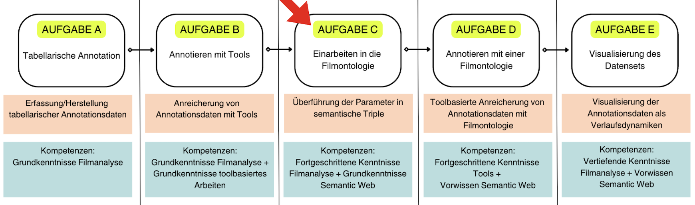

# Semantic Web Prinzipien

## Kapitelübersicht
[Semantic Web Prinzipien](Aufgabe_C) <br>
[Übung](Aufgabe_C_UK-1) <br>
[AdA-Filmontologie: Filmanalyse und Semantic Web](Aufgabe_C_UK-2) <br>
[Resümee](Aufgabe_C_UK-3)
+++
In diesem Kapitel sollen die Prinzpien von Semantic Web anhand der Überführung filmanalytischen Grundvokabulars in eine Ontolgie nachvollzogen und reproduziert werden.
+++
*Wir befinden uns hier:*


Wie funktionieren semantische Triple? In einem ersten Schritt wird erklärt, was semantische Triple sind und wie ihre Datenstruktur funktioniert. Anschließend wird erläutert, wie solche Triple für filmanalytische Grundbegriffe aussehen können. Eine [Übung zur Überführung der Grundbegriffe in Triple-Strukturen](Aufgabe_C_UK-1) soll helfen, die zuvor erläuterten Prinzipien zu reproduzieren. Wie eine komplexe auf Semantic Web basierende Filmontologie entwickelt wurde, wird im Kapitel [AdA-Filmontolgie: Filmanalyse und Semantic Web](Aufgabe_C_UK-2) ausführlich erklärt und mit Beispielen veranschaulicht. 

```{admonition} GROB- UND FEINLERNZIELE
:class: dropdown
**Groblernziel**
+++
Mithilfe von Annotationsdaten, die auf Basis einer filmanalytischen Ontologie erstellt und visualisiert werden, können audiovisuelle Inszenierungsmuster erkannt und differenzieren werden.
+++
**Feinlernziele**
1. Die Prinzipien von Semantic Web können verstanden werden.
2. Es kann beurteilt werden, was eine Datenontologie leistet.
3. Es kann nachvollzogen sowie reproduziert werden, wie filmanalytisches Vokabularium in die Ada Filmontologie umgeformt wird.
```

## Von der Freitextannotation zur Ontologie

Im vorigen Kapitel haben wir anhand von zwei Tools gezeigt, wie mithilfe digitaler Werkzeuge filmanalytisches Vokabular sowie formalästhetische Beschreibungen als Freitextannotationen entlang einer Timeline angelegt werden können. Die Annotationsspuren und Annotationen sowie ihre dazugehörigen Werte beruhen in diesem Schritt auf Freitexteingaben. Ein festgesetztes Datenframework zur Vereinheitlichung und Konzeptualisierung dieses Grundvokabulars lag dieser Arbeit noch nicht zugrunde.
+++
````{margin}
```{attention}
Am Ende des Kapitels gehen wir im Detail auf die AdA-Filmontologie ein.
```
````
In diesem Kapitel soll es darum gehen, diese Konzeptualisierung bzw. Systematisierung des Grundvokabulars der Filmanalyse in so ein Framework nachvollziehbar und als Übung reproduzierbar zu machen. Entwickelt wurde die sogenannte **AdA-Filmontologie** basierend auf den Ordnungsprinzipien und Funktionsweisen von Semantic Web Standards. Diese werden nachfolgend erläutert.

## Semantische Triple

Wie kann die Datenverarbeitung der Annotationen ermöglicht werden? Dazu müssen die filmanalytischen Beschreibungen der Annotationen maschinenlesbar gemacht werden. Gleichzeitig soll es nicht um eine reine "computer vision" gehen, sondern die Daten sollen auch für Menschen lesbar und verständlich sein. Die informationstechnologische Antwort darauf sind sogenannte semantische "**triple**". Diese bestehen aus für Menschen als einfache Sätze lesbare Aussagen nach dem Schema: "**Subjekt**" - "**Prädikat**" - "**Objekt**". Darin bezeichnet das "Prädikat" eine spezifische Relation zwischen dem "Subjekt" und dem "Objekt". Der entscheidende Schritt zur Maschienenlesbarkeit ist, dass alle drei Teile dieser Aussage mit eindeutigen "identifiern (URI)" verknüpft sind. Das kann für geschlossene Datensysteme eine einfache Zahlenkombination oder ein QR-Code sein, im Sinne der Vernetzung von Wissen sind es i.d.R. eine **URL**, also nach dem Format von Webadressen.
+++
Ein einfaches Beispiel:
+++
"**Berlin**" (Subjekt) - "**ist die Hauptstadt von**" (Prädikat) - "**Deutschland**" (Objekt)
+++
"**Berlin**" (Subjekt) - "**hat eine Einwohnerzahl von**" (Prädikat) - "**3.878.100**" (Objekt)
+++
Dadurch ist die Abfrage, wie viele Einwohner die Hauptstadt von Deutschland habe, möglich: Was ist der Wert für das Prädikat "**hat Einwohnerzahl von**" für die Entität auf die das Prädikat "**ist die Hauptstadt von**" den Wert "**Deutschland**" hat?
+++
Wenn in einer Datenbank - bzw. nennt man diese Verlinkung von Triplen zusammen einen “**Graph**” – alle Informationen auf diese Weise formalisiert sind, lassen sich alle möglichen Relationen abfragen: Eine Liste aller Hauptstädte, eine Liste von Städten nach Einwohnerzahl etc. <br>
Das Semantic Web arbeitet mit Sprachen zur Beschreibung der Inhalte, einer der bekanntesten ist "**RDF**" (Resource Description Framework). **RDF** ist eine Standardsprache zur Beschreibung von Ressourcen (Ressourcen können sein: ein Wort, ein Dokument, eine Grafik, eine Website usw.) im World Wide Web und wurde vom [World Wide Web Consortium](https://www.w3.org/) (W3C) entwickelt.
+++
Nehmen wir unser Beispiel von oben, als semantisches Triple formuliert in RDF mit URLs als URIs können unsere Relationen folgendermaßen aussehen:

```none
<http://example.org/Berlin> <http://example.org/istDieHauptstadtVon> <http://example.org/Deutschland>
```
Wie kann nun eine solche Formalisierung für die Begriffe der Filmanalyse aussehen? D.h., welche "Subjekte", "Prädikate" und "Objekte" sind hier sinnvoll festzulegen?

## Filmanalytische Begriffe als semantische Triple

Unser "Subjekt" ist immer "**Segment X**". Dieser Identifier ist zum einen verknüpft mit dem Film (Prädikat: "**ist aus**", Objekt: "**Film ABC**") und hat dort eine konkrete Anfangs- und Endzeit (Prädikat "**hat Timecode von**", Objekt: "**ff:ss:mm:hh - ff:ss:mm:hh**"). Diese Zeitangabe kann einer Einstellung entsprechen, einem einzelnen Frame oder einer freien Segmentierung. Zum anderen werden ihm auf verschiedenen Ebenen analytische Werte zugeschrieben. Damit diese Angaben als Relationen formulierbar sind, ist der erste Schritt, das Vokabular als Prädikate im Sinne von "**hat in einer bestimmten analytischen Dimension**" und Objekte der Art "**eine bestimmte Eigenschaft**" schematisch darzustellen.  
Für diesen Zweck hat das BMBF-geförderte Projekt ["Affektrhetoriken des Audiovisuellen"](https://www.ada.cinepoetics.fu-berlin.de/) einen Prototyp der Formalisierung vorgenommen und die [Ada-Filmontologie](https://www.ada.cinepoetics.fu-berlin.de/ada-toolkit/index.html) publiziert. Die Annotationen haben darin stets das Format: "**Segment X**" "**hat auf dem analytischen Type Y**" "**den Value Z**" (für einen besseren Überblick sind die einzelnen Typen zusätzlich auf analytischen "**Leveln**" gebündelt).

## Ontologie 

Eine Auflistung aller Subjekte/Individuen, Prädikate/Klassen/Typen oder Objekte/Eigenschaften/Werte eines Wissensgebiets wird in diesem Kontext als “**Ontologie**” bezeichnet. <br>
Insofern beschreiben Ontologien ein semantisches Modell, das Wissen struktuiert. Sie beschreiben und ordnen Begriffe und Beziehungen zueinander, um das formulierte Wissen maschinenlesbar zu machen. Wie bereits erwähnt, ermöglichen spezifische Sprachen, wie z.B. **RDF**, **OWL** oder **XSD**, Standards für die Formulierung sowie Formalisierung von Ontologien.
+++
Bevor wir jedoch hier im Detail auf die AdA-Filmontologie eingehen, haben wir ein paar Übungen erstellt, die nachvollziehbar machen sollen, wie diese Ontologie einige grundlegende Vokabularien formalästhetischer Beschreibung systematisiert erfasst.
