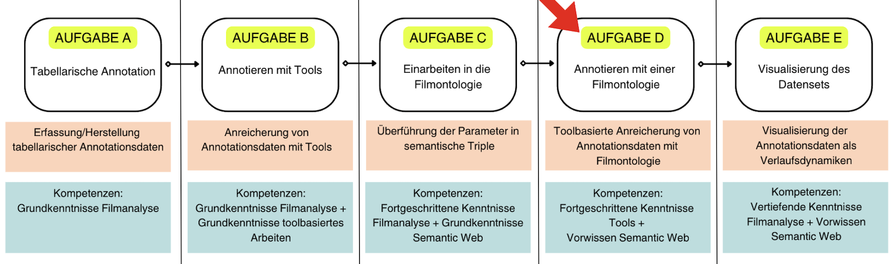

# Einführung

In diesem Kapitel erstellen wir Annotationen mit einer Filmontologie.
+++
*Wir befinden uns hier:*


## Kapitelübersicht
[Einführung](Aufgabe_D) <br>
[Annotation mit dem AdA-Template: Schritte und Arbeitsprozess](Aufgabe_D_UK-1) <br>
[Annotationsergebnisse: Vergleich und Übung](Aufgabe_D_UK-2) <br>
[Methodenreflexion und Diskussion](Aufgabe_D_UK-3)

:::{dropdown} Grob- und Feinlernziele
**Groblernziel**
+++
Mithilfe von Annotationsdaten, die auf Basis einer filmanalytischen Ontologie erstellt und visualisiert werden, können audiovisuelle Inszenierungsmuster erkannt und differenzieren werden.
+++
**Feinlernziele**
1. Die AdA Filmontolgie kann eingerichtet und implementierte automatische Erkenneralgorithmen durchgeführt werden.
2. Die Funktionen der Segmentierungsbereinigung können angewendet werden.
3. Ein Set an Annotationsdaten kann mit der Ada Filmontologie erstellt werden.
4. Mit diesen  Annotationsdaten können audiovisuelle Inszenierungsmuster erkannt werden.
:::

Im vorigen Kapitel haben wir gezeigt, wie anhand von Semantic Web Prinzipien eine filmanalytische Ontologie entstehen kann. Mehr Infos dazu, was eine filmanalytische Datenontolgie ist und leistet, gibt es [hier](Aufgabe_C) <br>
In diesem Schritt soll es nun darum gehen mit der AdA-Filmontologie in der Videoannotationssoftware [Advene](https://www.advene.org/) zu arbeiten. 
```{admonition} Kurz erklärt: Was ist die AdA-Filmontologie?
Die AdA-Filmontologie ist ein von der BMBF-geförderten Nachwuchsgruppe "[Affektrhetoriken des Audiovisuellen](https://www.ada.cinepoetics.fu-berlin.de/index.html)" (kurz: AdA) nach Semantic Web Standards entwickelts systematisches Beschreibungsvokabular filmanalytischer Konzepte und Termini. Sie ist zur Anwendung für komplexe und feingleiderige Videoannotationen ausgelegt. Die Ontologie ermöglicht die Herstellung und Visualisierung filmanalytischer Annotationsdaten. Mehr Infos und weiterführende Links gibt es in diesem [Book](Aufgabe_C_UK-2) sowie [hier](https://www.ada.cinepoetics.fu-berlin.de/Methoden/index.html) und [hier](https://www.cinepoetics.fu-berlin.de/methods/3_Tools/1_Vokabular_der_AdA-Filmontologie/index.html).
```
Untersuchungsgegenstand unserer Fallstudie sind Online-Videos zur Klimakrise. Entlang eines Videobeispiels soll diese Übung sowohl die Annotationsschritte als auch etwaige offene Fragen und Probleme, die sich während des Annotationsprozesses ergeben, skizzieren. Das Video ist als Download in diesem [Book](../Kapitel_I/Untersuchungsgegenstand.md) verfügbar. 
+++
Grundlage für die Annotationsarbeit in der Videoannotationssoftware Advene ist das [AdA-Template](../assets/AdA_template_07_2021.azp). Das AdA-Template ist ein Annotationspaket, welches das Vokabular der AdA-Ontologie bereits als vordefinierte Vorlage enthält.
```{hint}
Wer erst bei diesem Schritt einsteigt, kann sich notwendiges Vorwissen jeweils hier aneignen:
+++
[Einführung in die datengestütze Filmanalyse](../Kapitel_I/Einführung_in_die_datengestützte_Filmanalyse) <br>
[Untersuchungsgegenstand](../Kapitel_I/Untersuchungsgegenstand) <br>
[Einarbeiten in die Filmontologie](/Kapitel_II/Aufgabe_C)
```
## Videotutorials

````{margin}
```{note}
Die Videotutorials sind auf Englisch. Ein ausführliches Manual in deutscher Sprache (s.u.) steht ebenfalls zur Verfügung.
```
````
Für die Annotationsarbeit mit der Ontologie in Advene haben wir zwei Videotutorials erstellt (s.u.). Hier in Kürze eine Inhaltsübersicht zu den Videos:
```{image} ../assets/Videotutorial-Inhalte.png
:align: center
:height: 400px
:name: videotutorial-inhalte
```
<iframe src="https://videoup.uni-potsdam.de/Panopto/Pages/Embed.aspx?id=cf912751-5223-4132-80bb-b20300a60e55&autoplay=false&offerviewer=true&showtitle=true&showbrand=false&captions=false&interactivity=all" height="405" width="720" style="border: 1px solid #464646;" allowfullscreen allow="autoplay"></iframe>

## Weiterführende Infos und Material

Beide Videotutorials bieten gute Einstiegshilfen und Erklärungen der wichtigsten Funktionen und Anwendungen für die Arbeit mit der AdA-Filmontologie. Als Quick Guides sollen sie somit einen schnellen Start in die Annotationsarbeit ermöglichen. 
+++
Im Rahmen des AdA-Projekts wurde als Teil des AdA-Toolkits ein Manual entwickelt, welches darüber hinaus noch ausführlichere Anweisungen bereitstellt (QUELLE: Pfeilschifter et. al.). Detaillierte und spezifische Hilfen zu den je einzelnen Funktionen können dem Manual entnommen werden. Hier steht das Manual in deutscher Fassung zum Dowload bereit: [AdA-Manual](../assets/Manual_Advene_AdA_D_Vers1_0.pdf). Eine englische Version kann vom [AdA-Toolkit](https://www.ada.cinepoetics.fu-berlin.de/ada-toolkit/index.html) bezogen werden.

## Die nächsten Schritte...
```{image} ../assets/Laptop-Manual.png
:align: right
:height: 200px
:name: laptop-manual
```
1.	Videos anschauen und Manual (bei Bedarf) hinzuziehen <br>
2.	Advene starten und loslegen! 🎬
+++
```{seealso}
Unseren Workflow mit einigen Übungsfragen haben wir auf der nächsten Seite notiert. 
```

