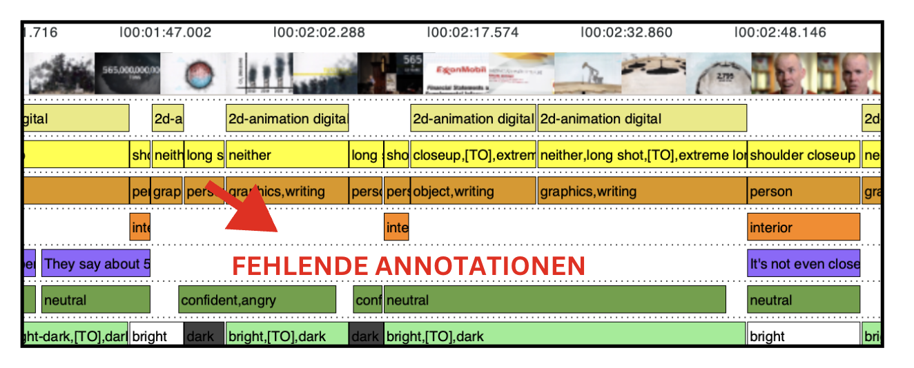
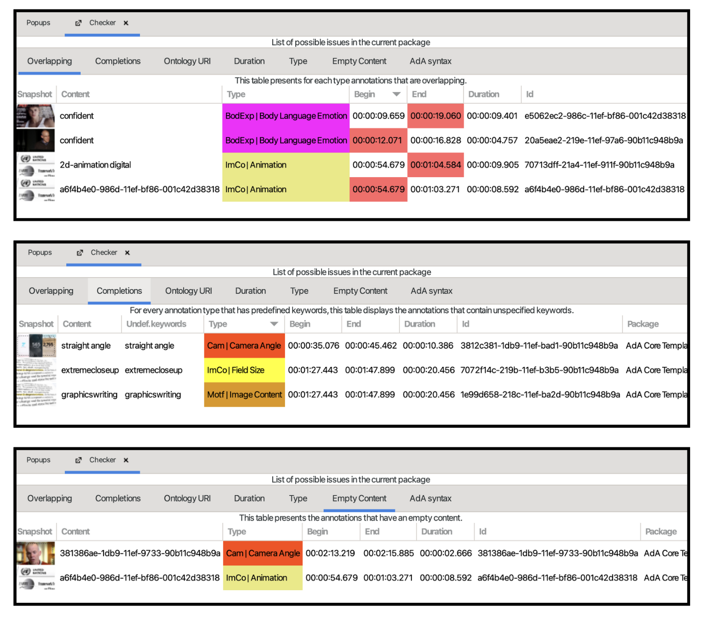
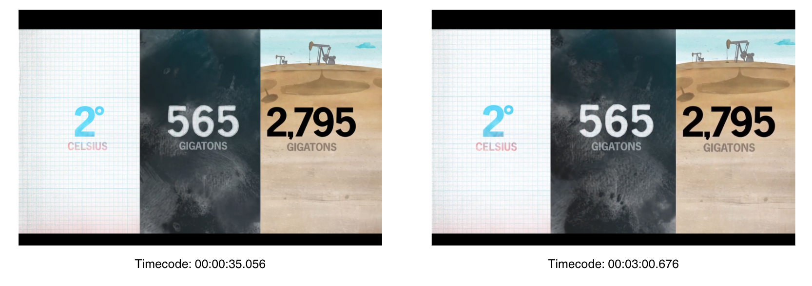

---
jupytext:
  formats: md:myst
  text_representation:
    extension: .md
    format_name: myst
kernelspec:
  display_name: Python 3
  language: python
  name: python3
---
```{code-cell} ipython3
:tags: [remove-cell]
from jupyterquiz import display_quiz

import sys
sys.path.append("..")
from quadriga_config import colors
```

# Annotationsergebnisse: Datenabgleich und -erläuterung


Sobald die Annotationsarbeit für das Video abgeschlossen ist, kann das Paket mit unserer Musterlösung verglichen werden. Die Lösungsdatei steht [hier](../assets/QUADRIGA-Fallstudie-Annotationspackage.azp) zum Download bereit. Hier darauf achten, dass die Videodatei neu verknüpft werden muss.

+++
```{important} 
Trotz der Verwendung der Ontologie können sich Annotationsentscheidungen von Person zu Person unterscheiden. Wichtig ist, dass die Ergebnisse miteinander verglichen werden können. Punktuelle Erläuterungen unserer Entscheidungen werden in diesem Kapitel ausgeführt. 
```
## Importfunktion

In Advene gibt es die Möglichkeit ein bestehendes Packages in ein anderes zu importieren.

`````{admonition} Wofür kann in diesem Schritt die Importfunktion nützlich sein?
:class: tip
````{admonition} Antwort
:class: dropdown
Diese Funktion ist hilfreich, um beispielsweise verschiedene Annotationen, die zum gleichen Video erstellt wurden, miteinander zu vergleichen.
+++
Hierzu folgende Schritte durchführen:
+++
1. Unter “File” die Option “Import package” anklicken
2. Das zu importierende Packet auswählen
3. Im “Package importer view” zur Unterscheidung der Annotationstypen einen Titelzusatz, wie z.B. IMPORTED, angeben. Dieser Zusatz wird hinter die importierten Annotationstypen gehängt
4. Anschließend die gewünschten Annotationstypen, die importiert werden sollen, anklicken
5. Die importierten Annotationstypen stehen nun zur Verfügung und können in der Timeline View angezeigt werden
`````

Ein ausführlicherer Guide für das Importieren findet sich sowohl unter Punkt 3.3 (S. 45ff) im Manual als auch im zweiten Videotutorial (Video: XX)

## Error-Package: Fehlersuche & Korrektur

Im Folgenden steht hier ein [Package](../assets/QUADRIGA-Errorpackage.azp) bereit, in dem einige Fehler eingebaut sind.

`````{admonition} Welche Fehler konnten gefunden werden?
:class: tip
````{admonition} Lösung
:class: dropdown
1. Auf der Spur 'Dialogue Text' wurden 2 Annotationen gelöscht

2. Auf der Spur 'Shot' wurden Annotationen gemerged und nicht renummeriert 

3. Auf der Spur 'Recording/Playback Speed' hat die erste Annotation einen falschen Wert ➡️ statt 'timelaps' müsste dort 'normal' eingetragen werden 
4. Der Annotationstyp 'Volume' wurde gelöscht
+++
Weitere Fehler können durch eine Überprüfung mit der Checker-Funktion gefunden werden. Um den Checker als View zu öffnen, oben in der Menüleiste auf 'View > Open View' gehen und den Checker anklicken. Folgende Fehler sind über den Checker auffindbar:
+++
5. a) Overlapping: Annotationen, die sich in ihrer Dauer überlappen
6. b) Completions: Undefinierte Keywords, die von den Keywords der Ada-Ontologie abweichen
7. c) Empty Content: Annotationen ohne Inhalt

`````

`````{admonition} Wie können die Fehler korrigiert werden?
:class: tip
````{admonition} Lösung
:class: dropdown
Es kann auch hier für einen direkten Abgleich nützlich sein das korrekte Annotationspaket zu importieren. 
+++
Nachfolgend gehen wir alle Fehler kurz durch und stellen eine Lösung bereit:
+++
1. Annotation neu hinzufügen und durch Freitext-Eingabe Untertitel als Annotionswert ergänzen. ODER: Import der Lösungsdatei und die fehlende Annotation aus der Spur reinkopieren; ebenso kann die Gesamtzahl der Annotationen für einen Typ durch einen Rechtsklick (ganz unten in der Pop-up-Liste) angezeigt werden, so kann durch die Überprüfung der Gesamtzahl der Annotationen für eine Spur direkt nach Abweichungen kontrolliert werden
2. Shots wieder richtig segmentieren und korrekt renummerieren 
3. Falschen Wert korrigieren 
4. Durch Import des Templates kann der Annotationstyp 'Volume' erneut importiert werden. Anschließend automatische Erkenner für 'Waveform' durchführen und die automatisch generierte Annotation auf die Spur 'Volume' duplizieren; danach die neu erstellte Spur löschen (so bleibt die Spur als Teil der vordefinierten AdA-Syntax erhalten)
5. a) Overlapping Annotations, b) Unspecified Keywords und c) Empty Content: hier zunächst die Checker Funktion aktivieren. Anschließend Fehler beheben indem für a) eine Korrektur des Timecodes für die sich überschneidenden Annotationen durchführt, für b) die richtigen Keywords gemäß Ontologie einträgt und c) den leeren Annotationen die richtigen Werte zuordnet
`````

## Diskussion der Ergebnisse

Mit der AdA-Filmontologie kann ermöglicht werden auf der Grundlage eines Klassifikationsschemas filmanalytische Beobachtungen zu systematisieren. Die Systematisierung ist also ein notwendiger Schritt, um Metadaten einerseits unter ganz spezifischen Kriterien herzustellen als auch anschließend vergleichen zu können. 
+++
Ziel dieser Fallstudie ist es in einem nächsten Schritt durch die Visualisierung dieser Metadaten audiovisuelle Inszenierungsmuster zu analysieren und als Affekrhetorik zu qualifizieren. Doch bevor wir uns der eigentlichen Analyse widmen, wollen wir die Ergebnisse der Annotationsarbeit diskutieren. Denn Annotationsentscheidungen sind nicht immer selbsterklärend. Und auch eine Ontologie kann ihre Grenzen aufweisen. 
+++
Für die Diskussion gehen wir nachfolgend punktuell auf konkrete Probleme und Fragen ein, die während des Annotierens aufgekommen sind. Da eine ganzheitliche Diskussion aller Annotationsentscheidungen und Schritte den Rahmen dieser Übungen sprengt, adressieren wir hier die wichtigsten.

### Annotationstyp: Field Size (Einstellungsgröße)

Die Frage nach dem Referenzobjekt zur Bestimmung der Einstellungsgröße ist nicht immer eindeutig. Dies gilt insbesondere für die Einstellungen, die 2D animiert sind oder in denen eine Frame-in-Frame Anordnung zu sehen ist.
+++
Bei Einstellungen also, in denen die Bestimmung des Referenzobjekts zur Messung der Einstellungsgröße unklar blieb, haben wir den Wert 'neither' eingetragen, wie beispielsweise hier:
+++
```{image} ../_images/A4-S04.png
:align: center
:height: 300px
:name: A4-S04
```
````{margin}
```{hint}
Um UUIDs (universally unique identifier) zu suchen, muss die Suchfunktion angepasst werden. Dazu einen Rechtsklick auf das Lupen-Symbol neben dem Suchfeld und die Option 'Searched
elements' auswählen. Im sich öffnenden Fenster die Option 'Ids' (am Ende der Liste, Liste ggf. aufziehen) auswählen.
```
````
Die UUID dieser Annotation ist folgende: `0aac70ea-219b-11ef-9bca-90b11c948b9a`
+++

`````{admonition} Warum ist die Festlegung auf einen Wert in dieser Einstellung schwierig?
:class: tip
````{admonition} Antwort
:class: dropdown
Auf eine 2D simulierte Ansicht eines Papierblocks blendet sich von links nach rechts der in blau gefärbte Schriftzug "The Numbers" ein. Diese Ansicht erinnert an eine Präsentationsfolie. Obwohl die Einstellung im Verhältnis zu unserem Standpunkt nah wirken mag, lässt sich eine Distanz nicht eindeutig festlegen, da die Einbettung in eine räumliche Umgebung fehlt, die eine Skalierung zulassen würde. 
`````

#### 2D-Animationen

Bei multiplen und/oder simultan auftretenden Animationselementen sieht es ähnlich aus. Es gibt keine klaren Relationen oder Anhaltspunkte im Raum, durch die eine Skalierung zur Bestimmung einer Einstellungsgröße nach bekannten Systemen möglich wäre, wie es bei dieser Annotation mit der UUID `3fbfc132-00a8-11ef-a9a8-001c42d38318` der Fall ist:
```{image} ../_images/A4-S05.png
:align: center
:height: 300px
:name: A4-S05
```
In diesem Beispiel wäre die Möglichkeit für ein kontrastierendes Syntaxelement wie [VS] ebenfalls sinnvoll, da durch die Trennung der verschiedenen Bildgrenzen multiple Elemente zu sehen sind. Wir haben uns für die Werte 'neither' sowie 'extreme long shot' entschieden. Der Wert 'extreme long shot' ist anwendbar auf das rechte Bild im animierten Splitscreen. Die Referenzobjekte zur Bemessung der Entfernung sind hier die Kräne. <br>
Dort, wo Fragen nach Skalierungen und Referenzbestimmungen komplexer werden, zeigen sich jedoch gleichzeitig auch die Grenzen einer Ontologie.

#### Frame-in-Frame

In Bezug auf die Frame-in-Frame-Einstellungen gilt folgende Entscheidung innerhalb unseres Workflows: <br>
Sowohl der äußere Rahmen als auch das in diesem Rahmen eingesetzte Bild können als Referenzobjekt bestimmt werden. Daher haben wir uns für den Wert 'neither' und dem Wert für die Einstellungsgröße entschieden, der aus dem zweiten Frame hervorgeht. Ein Annotationsbeispiel mit den Werten 'neither' und 'medium close up' ist hier und unter folgender UUID `3fc06a7e-00a8-11ef-a9a8-001c42d38318` zu sehen:
```{image} ../_images/A4-S06.png
:align: center
:height: 300px
:name: A4-S06
```
### Annotationstyp Setting 

Das 'Setting' wird innerhalb der Ontologie als Ort des narrativen Handlungsgeschehens definiert. Doch wie geht man mit Einstellungen um, die nur schwer narrativ zu fassen sind und deren örtliche Bestimmung kaum möglich ist?
+++
In Bezug auf unser Beispielvideo betrifft dies insbesondere jene Einstellungen, die 2D animiert sind. Denn dort beziehen sich die animierten Elemente – insbesondere die Schriftzüge, die Nummerneinblendungen oder die Simulationen der Weltkugel – auf keine realen Verhältnisse oder räumlichen Anordnungen. Bei Einstellungen, in denen das Setting nicht ohne weiteres bestimmbar war, haben wir keine Annotationen erstellt. Diese leeren Abschnitte verweisen insofern direkt auf die Grenzen bzw. Leerstellen der Ontologie. Folgende Annotation unter der UUID  
`860166ff-21a4-11ef-a632-90b11c948b9a` macht dieses Problem exemplarisch sichtbar: 
```{image} ../_images/A4-S07.png
:align: center
:height: 300px
:name: A4-S07
```
### Annotationstyp: Recording/Playback Speed

Durch den Annotationstyp Recording/Playback Speed kann die Aufnahmegeschwindigkeit erfasst werden. Es gibt Annotationen von sehr kurzer Dauer, die einen Timelaps markieren. Definiert wird der Timelaps folgendermaßen:

> Noticeable acceleration of the viewers' time perception.
Movements appear as unnaturally fast. Objects, such as
plants, that may otherwise be perceived as static can get
animated through this technique in comparison to everyday
perception QUELLE ONTOLOGIE 

In diesem Screenshot ist die Erfassung solcher Timelaps in der Timeline zu sehen: 


Die dazugehörigen Annotationen können unter folgenden UUIDs gefunden werden: `87b572d2-1dbb-11ef-a911-90b11c948b9a` sowie `ab1283ac-1dbb-11ef-b029-90b11c948b9a`

Die dazugehörige Einstellung ist hier nochmal als Ausschnitt zu sehen: <br>
VIDEO EINFÜGEN 

```{code-cell} ipython3
:tags: [remove-input]
display_quiz("../quizzes/D_UK-2_Quiz-1.json", colors = colors.jupyterquiz)
```

```{admonition} Antwort
:class: dropdown
Die Bewegungsrichtung der Kamera korreliert mit den Timelaps. Mit der Änderung der Bewegungsrichtung synchron zu dem Einsatz des Timelaps entsteht eine dynamische Bildkomposition, die sich durch Geschwindkeitszunahme sowie Bewegungsveränderung von der restlichen zeitlichen Anordnung des Videos unterscheidet. 
Interessant ist ebenso, dass die markantesten Bewegungsveränderungen der Kamera mit den animierten Einstellungen einhergehen. Die 2D-Animationen wirken, insbesondere im Kontrast zu den im Vergleich recht statischen Szenen auf der Bühne oder im Interview, wesentlich energetischer.
```

### Advene-Timeline und Weiterentwicklung der Timeline

Die Timeline in Advene ist bereits eine Form von Visualisierung, mit der Inszenierungsmuster erkennbar werden. Was die Synchronizität, Temporalität und Multimodalität der einzelnen Spuren angeht, ist sie jedoch nur begrenzt lesbar. Eine speziell entwickelte Visualisierung, die diese Dynamiken unter der Möglichkeit spezifischer Konfigurationsoptionen ins Zentrum der Analyse rückt, ist also ein wichtiger Schritt zur Anpassung der Datenqualifizierung an die konkreten Anforderungen filmwissenschaftlicher Analyse. <br>

````{margin}
```{admonition} Was ist die AdA-Timeline?
Die AdA-Timeline ist eine dynamische, individuell konfigurierbare browserbasierte Timeline-Ansicht, mit der die mit der AdA-Ontologie erstellten Annotationen visualisiert werden können.
```
````
Eine ausführliche Datenexploration sowie Hypothesenpräsentation führen wir dahingehend mit der AdA-Timeline im Kapitel [Datenvisualisierung](Aufgabe_E) durch. 

## Miteinbeziehung weiterer Annotationstypen 

Für eine präzise und vollständige Annotation empfiehlt es sich mit allen Annotationstypen der Ontologie zu arbeiten. Da die Annotation aller Typen der Ontologie weitaus mehr Zeit in Anspruch nimmt als im Rahmen der Übungen vorgesehen, haben wir uns für die Annotation mit dem AdA Core-Template entschieden. 
+++
Wie sieht jedoch mit den Annotationstypen 'Splitscreen', 'Frame-in-Frame' oder 'Visual Pattern' aus? Inwiefern könnten diese Typen die spezifischen Charakteristika unseres Beispielgegenstandes hervorheben?

### Splitscreen

Eine sehr dominante und für das Video entscheidende Inszenierungsmodalität ist die Verwendung von Splitscreens. Insgesamt zwei Splitscreens werden in den Animationsabschnitten eingesetzt und sind in ihrer Darstellung identisch.



In den je abgetrennten Screens werden die drei kritischen Zahlen für eine Einhaltung der 2-Grad-Grenze in Bezug auf den Co2-Austoß als visuelle Einheit inszeniert. 
+++
Durch die Miteinbeziehung der Annotationstypen für Splitscreens könnten die Häufigkeit, die Anzahl der verwendeten Splitscreens innerhalb einer Einstellung und darüber hinaus die Splitscreen-Dynamiken erfasst werden.  

### Frame-in-Frame

Die auffälligsten Frame-in-Frame Kompositionen finden sich in den Einstellungen, die Found Footage Material einbinden. Die Frame-in-Frame Anordnung markiert somit einen klaren visuellen Bruch in der gesamten Bilddynamik und ordnet das gezeigte Material in den Verwendungszusammenhang des Videos ein.

```{image} ../assets/Found-Footage-Reihe.png
:width: 700px
:align: center
```
Ebenso könnte diskutiert werden, inwiefern sowohl die Frame-in-Frame Einbindungen des Found Footage Materials als auch die animierten Einstellungen Teil des Vortragsarrangements auf der Bühne sind, wie in dem ersten Bild der Reihe als auch in diesem diesem Beispiel zu sehen ist:

```{image} ../_images/A4-S10.png
:align: center
:height: 300px
:name: A4-S10
```

Sichtbar hier wird eine Screen-within-Screen Gestaltung, die unter dem Annotationstyp Frame-in-Frame ebenfalls Berücksichtigung findet und annotiert werden kann. 
+++
Eine freitextliche Erhebung von Frame-in-Frame Kompositionen könnte die spezifischen Modalitäten dieser Inszenierungsmuster für eine Datenanalyse insofern sinnvoll ergänzen. 

### Visual Pattern

Unter dem Annotationstyp 'Visual Pattern' werden abstrakte Muster oder Formen erfasst. Insbesondere in den animierten Einstellungen könnten unter Miteinbeziehung dieses Annotationstyps grafische Elemente, Synchronizitäten von Mustern und abstrakte Visualisierungsstrukturen bestimmt werden. Ein Beispiel für eine Annotation der Werte 'centre Figure, circular' wäre folgende Ansicht:

```{image} ../_images/A4-S11.png
:align: center
:height: 300px
:name: A4-S11
```
Insgesamt bietet das Framework der Ontologie sehr umfangreiche und spezifische Annotationsoptionen, die an den zu untersuchenden Gegenstand angepasst und jederzeit erweitert werden können. Dies ermöglicht die Herstellung feingliederiger Mikroanalysen auf der Basis von allumfassenden Annotationsdaten. 