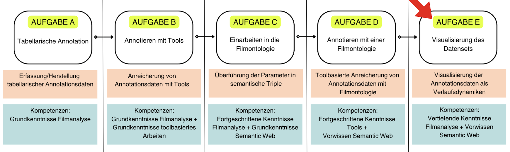

# Einführung

## Kapitelübersicht
[Einführung](Aufgabe_E) <br>
[AdA-Timeline: Funktionsweisen, Bedienung, Anpassung](Aufgabe_E_UK-1) <br>
[Übung zur Konfiguration der Timeline und Qualifizierung der Daten](Aufgabe_E_UK-2) <br>
[Resümee](Aufgabe_E_UK-3)

In diesem Kapitel visualisieren wir die mit der AdA-Ontologie erstellten Annotationen.
+++
*Wir befinden uns hier:*


Im vorangegangen Kapitel haben wir ein Annotationspaket mit der AdA-Ontologie erstellt. In diesem Kapitel werden wir die Annotationsdaten mit der AdA-Timeline visualiseren. Dazu werden wir uns zuerst die [Funktionsweisen der AdA-Timeline](../Kapitel_II/Aufgabe_E_UK-1.md) anschauen: Wie funktioniert die Bedienung? Wie können die Funktionen angepasst werden? Eine nachfolgende [Übung zur Konfiguration der Timeline](../Kapitel_II/Aufgabe_E_UK-2.md) soll helfen, das Erlernte zu erproben. Mit den spezifischen Konfigurationsoptionen sollen die Datensätze der Visualisierung in einem letzten Schritt durch eine Hypothesenrepräsentation qualifiziert werden. Hier werden dezidiert die Ausgangsfragen und Hypothesen unserer Fallstudie am Untersuchungsgegenstand aufgegriffen.

```{admonition} GROB- UND FEINLERNZIELE
:class: dropdown
**Groblernziel**
+++
Mithilfe von Annotationsdaten, die auf Basis einer filmanalytischen Ontologie erstellt und visualisiert werden, können audiovisuelle Inszenierungsmuster erkannt und differenzieren werden.
+++
**Feinlernziele**
1. Die mit der AdA-Filmontologie erstellten Annotationen können visualisiert und die Visualisierungsoptionen angepasst werden.
2. Temporale und multimodale Muster können erkannt, differenziert  und ausgewertet werden.
3. Auf Grundlage der Qualifizierung dieser Muster sowie Exploration der Daten können Hypothesen abgeleitet und präsentiert werden. 
```

Wie können Annotationsdaten repräsentierfähig gemacht werden und welche Möglichkeiten der Datenexploration kann es geben? <br>
Im Rahmen der AdA-Ontologie wurde die sogenannte AdA-Timeline, eine dynamische, browserbasierte Timeline-Ansicht entwickelt. Die mit der AdA-Ontologie hergestellten Annotationsdaten können somit direkt als Anordnungen visualisiert werden. Die AdA-Timeline ist sowohl ein Werkzeug zur Greifbarmachung empirischer Daten als auch selbst eine dynamische Datenansicht. Im Unterschied zu einer linearen Timelineansicht ist die AdA-Timeline flexibel anpassbar. Es gibt zahlreiche Visualisierungsoptionen, die es ermöglichen die zuvor erstellten Annotationsdaten in Form verschiedener Ansichten darzustellen. <br>
Dabei orientiert sich die Ansicht an Partituren: Zeitliche Dynamiken eines Films werden auf unterschiedlichen Gestaltungsebenen in ihrem Zusammenspiel lesbar. Die Annotationstypen der AdA-Filmontologie werden also – ähnlich wie Partituren – als synchrone Spuren untereinander dargestellt. 

```{important}
Die AdA-Timeline ist nicht auf die Erstellung und
Bearbeitung von Annotationen ausgelegt, sondern dient der **Datenexploration** und
**Hypothesenpräsentation**.
```
## Warum wurde diese spezifische Form der Visualisierung entwickelt?

Filme sind zeitbasierte Medien. Eine empirische Auseinandersetzung sollte also stets immer versuchen darauf abzuzielen, diese zeitliche Beschaffenheit von Filmen einzuholen. Im Konkreten bedeutet dies, dass die sich zeitlich entfaltenden Dynamiken der Gestaltungsebenen (z.B. Kamerabewegung, Musik, Farbe etc.) nicht nur in ihrem Verlauf, sondern auch insbesondere in ihrer Synchronität zueinander greifbar gemacht werden sollen. <br>
Deskriptive Methoden heben diese zeitliche Dimension von Filmen zwangsweise auf, indem sie die Bewegungsdynamik, beispielsweise durch das Anhalten, Aufteilen und Segmentieren des Gegenstandes, unterbrechen. Diese Diskrepanz kann zwar nicht verhindert werden, es gibt aber Möglichkeiten die zeitbasierte Beschaffenheit auch auf empirischer Ebene aufrechtzuerhalten und ferner die temporale und multimodale Spezifik von Bewegtbildern analysierbar zu machen. Die AdA-Timeline kann als eine solche Möglichkeit beschrieben werden. 
+++
Im nächsten Schritt machen wir uns mit den Funktionen und Anpassungsoptionen der AdA-Timeline vertraut. Grundlage für die Erstellung der Timeline ist ein mit der AdA-Ontologie erstelltes Annotationspaket. Hierzu kann das Paket aus der vorigen Übung verwendet werden. Ist das Paket aus Übung 4 noch nicht vollständig ausgefüllt, kann unsere Musterlösung verwendet werden.
