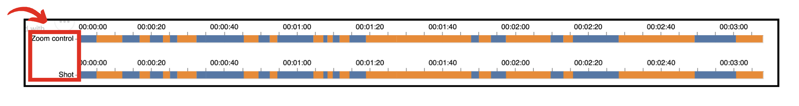
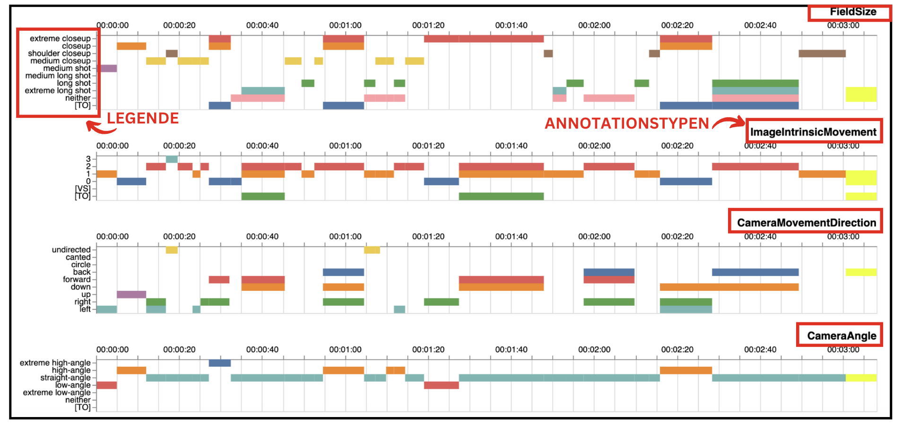
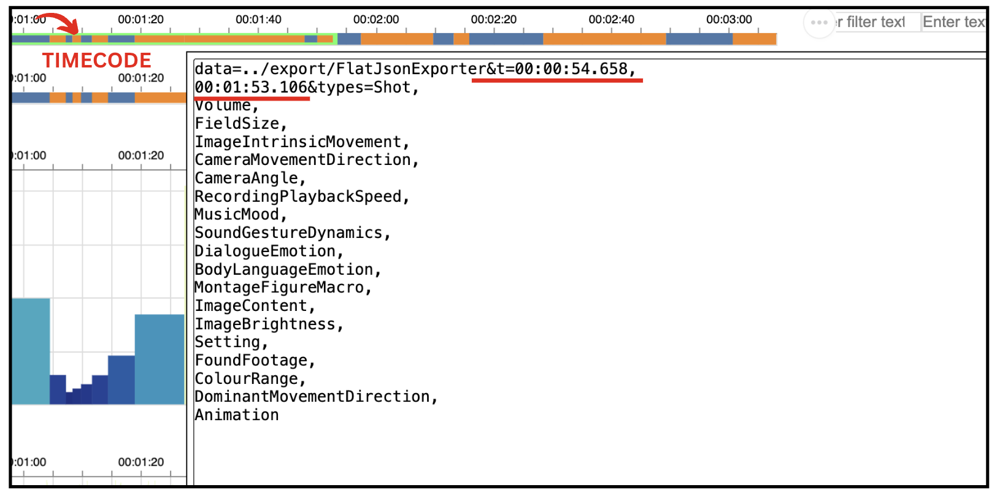

# AdA-Timeline: Funktionsweisen, Bedienung, Anpassung

````{margin}
```{note}
Das Videotutorial ist auf Englisch. Für eine deutsche Fassung bitte das Manual verwenden.
````
In dem Video-Quickguide zur AdA-Timeline (Quelle/creative common: Stratil, Huthmann, Demir) werden Aufbau und Funktion, verschiedene Anpassungsoptionen in der Darstellung sowie Exportmöglichkeiten erläutert. Für detaillierte Beschreibungen zu allen Optionen empfehlen wir das [Manual](../assets/Manual_Advene_AdA_D_Vers1_0.pdf).
+++
Eine kurze Inhaltsübersicht soll zur Orientierung dienen. Wer ab einem bestimmten Inhaltsabschnitt starten möchte, kann auf den in Klammern beigefügten Link klicken. Das Video in voller Länge ist unten abrufbar.
+++
## Video: AdA-Timeline

* Introduction: AdA Timeline
* Opening the AdA Timeline in Advene
* Structure and Functionality
* Display Customization (URL, Edit Window, and Syntax Elements)  
* The Syntax 
* Setting for Types
* Saving Timeline Settings
* Export

<iframe src="https://videoup.uni-potsdam.de/Panopto/Pages/Embed.aspx?id=e1e937e6-7bd3-43fa-a4f3-b20300a66b54&autoplay=false&offerviewer=true&showtitle=false&showbrand=false&captions=false&interactivity=all" height="405" width="720" style="border: 1px solid #464646;" allowfullscreen allow="autoplay"></iframe>

# Die wichtigsten Schritte im Überblick

## Timeline aufrufen

````{margin}
```{note}
Die Timeline wird mit dem Standard Browser geöffnet. Die URL kann jedoch auch in einem anderen installierten Browser geöffnet werden.
```
````
In Advene muss zunächst das mit dem AdA-Template erstellte Annotationspaket geöffnet werden. Anschließend kann über das W3-Symbol in der Icon-Leiste eine Visualisierungsform ausgewählt werden. Hier entweder die online oder offline Version der Timeline auswählen. Wir arbeiten in dieser Übung mit der online Variante. 
```{image} ../_images/A5-S02.png
:align: center
:height: 300px
:name: a2-s02
```
```{hint}
In der Online-Variante werden aktuelle Visualisierungsdatenbanken von der Homepage des Entwicklers abgerufen, in der Offline-Variante werden lokale Ressourcen der jeweiligen aktuellen Advene-Version genutzt.
```
Am oberen Rand umfasst die Timeline zwei fixierte Spuren: 1. Die zoom control, mit der man frei skalieren kann und 2. die Referenzspur, welche den jeweils ausgewählten Bereich anhand eines festgelegten Annotationstypen anzeigt.

````{margin}
```{note}
Beim Öffnen ist die Referenzspur automatisch auf den Annotationstypen "shot" festgelegt. Dies kann über das Edit-Fenster geändert werden. Mehr Infos zur Anpassung s.u.
```
````


Die Zoom-Funktion erlaubt sowohl die Übersicht über einen gesamten Film als auch das beliebige Hineinzoomen in Detailansichten. Um den zoom control zu bedienen, die linke Maustaste gedrückt halten und den Bereich skalieren, der angezeigt werden soll. Den Browser danach aktualisieren.
+++
Alle weiteren im Hauptbereich der Timeline angezeigten Spuren zeigen die einzelnen Annotationstypen untereinander. Sie sind auf den denselben Zeitabschnitt wie die Referenzspur bezogen, sodass alle untereinander angezeigten, spurenübergreifenden Werte zeitgleiche Phänomene adressieren.
+++
Die einzelnen Werte der Annotationstypen werden links als Legende angezeigt. 


# Anpassungsoptionen

Die AdA-Timeline verwendet eine textbasierte Syntax für die Darstellungskonfiguration. Diese ist als für Menschen lesbare URL enkodiert. Mit der Textcharakteristik der Syntax können – auch ohne Programmierkenntnisse – selbstständig Visualisierungen mit unterschiedlichen Einstellungen erstellt und verändert werden. 
+++
````{margin}
```{attention}
Wer die Timeline über die URL-Syntax konfigurieren will, findet auf S. 141 des Manuals die Anweisungen.
```
````
Anpassungen der AdA-Timeline können sowohl direkt über die URL als auch über das Edit-Fenster vorgenommen werden. Aufgrund der besseren Übersichtlichkeit empfiehlt sich die Anpassung der Timeline im Edit-Fenster. Diese Option beschreiben wir auch kurz hier.

## Anpassungen mit dem Edit-Fenster

Um das Edit-Fenster zu öffnen, oben rechts im Browser auf 'Edit' klicken. Nun öffnet sich das Fenster.

```{image} ../_images/A5-S05.png
:align: center
:height: 200px
:name: a5-s05
```
+++
Veränderungen an der Darstellung der Timeline werden über Syntaxelemente vorgenommen. Eine Übersicht aller Syntaxelemente ist [hier](../assets/Übersicht-Syntaxelemente-AdA-Timeline.pdf) einsehbar. <br>
Beim Öffnen des Edit-Fensters erscheint das Textfeld der Syntax. Syntaxelemente werden mit einem `&` voneinander getrennt. 
+++
Wird ein spezifischer Zeitabschnitt über die zoom control für die Anzeige gewählt, so wird dieser Abschnitt als Timecode in der Syntax wie folgt dargestellt: `&t=00:00:32.658,00:01:19.094`
+++
Der Timecode kann über das Edit-Fenster angepasst werden. Hierzu einfach die genauen Zeiteingaben eintragen. 


````{margin}
```{hint}
Wie ein Video mit der Timeline verknüpft werden kann, wird im Manual ab S. 148 im Detail beschrieben. 
```
```` 
Danach können verschiedene Syntaxelemente eingesetzt werden, zum Beispiel `reference=`, um den Annotationstyp festzulegen, der als Referenzspur verwendet wird, oder `media=`, um ein Video einzubinden. Nach dem Element `types=` werden die einzelnen Annotationstypen, die in der Visualisierung angezeigt werden sollen, angegeben. Als Name wird dabei immer die 'Id' des Annotationstyps verwendet. Die Ids der Annotationstypen werden mit einem Komma voneinander getrennt. Kopieren kann man die Id direkt aus Advene mit einem Rechtsklick auf den Annotationstyp und dann auf 'Copy id'.
+++
Nach der Id können für jeden Annotationstyp in einer Klammer verschiedene Darstellungsoptionen angegeben werden (s. [Übersicht der Syntaxelemente](../assets/Übersicht-Syntaxelemente-AdA-Timeline.pdf))
+++
Die Eingabe erfolgt immer in der Syntaxform DARSTELLUNGOPTION:WERT, ein Beispiel für die Darstellung als Histogramm wäre: `representation:hist`.

```{attention}
Zur korrekten Konfigurierung der Darstellung den Wert `height` jeweils anpassen.
```
````{margin}
Die Farbschemata können unter https://vega.github.io/vega/docs/schemes/ abgerufen werden.
````
Beispielsweise kann die Farbe der Balken über das Syntaxelement `colorscheme` geändert werden. Hier ist ein Beispiel für `colorscheme:purplered` zu sehen:


Werden für einen Annotationstyp mehrere Optionen definiert, werden diese mit einem Leerzeichen voneinander getrennt.

### Darstellungsformen

Es gibt verschiedene Darstellungsformen, um die Timeline zu konfigurieren. Umfassende Informationen zu **allen** Darstellungsformen sind auf S. 138 im Manual einsehbar. Hier die wichtigsten in Kürze:

* **Säulenansicht**, z.B. zur Darstellung von des Schnittrhythmus. Breite und Höhe der einzelnen Blöcke entsprechen in dieser Darstellung jeweils der Dauer einer Annotation.
* **Balkendiagramm**: Die Annotationen werden in Zeilen mit je eigenen Farben als Balken angezeigt.
* **Wellenform**: Nummerische Werte können als Wellenform dargestellt werden.
* **Einzeilige Darstellung**: Eine einzeilige Darstellung bietet sich bei Annotationstypen ohne Überlappungen von Werten an.
* **Farbwerte**: Balkendiagramm, bei dem die Balkenfarben den annotierten Farben entsprechen. 


## Visualisierungsansicht speichern und exportieren

Um die erstellten Visualisierungen zu speichern, empfiehlt es sich den Inhalt des Edit-Fensters in ein gängiges Textprogramm zu kopieren. Öffnet man die Timeline erneut, so kann man den kopierten Inhalt einfügen und die gespeicherte Ansicht anzeigen lassen.
```{danger}
Um keine Ansichtsdaten zu verlieren, sollte zum Speichern der gewünschten Konfiguration wie oben beschrieben vorgegangen werden! Das Speichern über den 'Save'-Button im Edit-Fenster ist nicht möglich.
```
Um die Timeline-Visualisierung zu exportieren, auf die drei Punkte am oberen linken Rand klicken und eine Option auswählen. Für Publikationen oder Präsentationen bietet sich der Export als PNG-Datei an. 
+++
Im nächsten Schritt soll das Konfigurieren der Timeline erprobt werden. Ebenso sollen im letzten Teil unserer Fallstudie anhand der Timeline die Annotations- und Visualisierungsdaten filmanalytisch qualifiziert werden. Damit beziehen wir uns auf die eingangs formulierten Fragestellungen:
> 1. Wie können datengestützte Methoden für die Qualifizierung von filmwissenschaftlichen Analysen nutzbar gemacht werden? <br>
> 2. Inwiefern können durch empirisch hergestellte quantifizierbare Daten Aussagen über die Qualifizierung audiovisueller Inszenierungsdynamiken und den damit verbundenen Affizierungen getroffen werden?