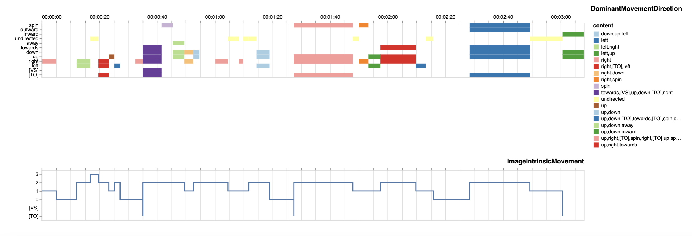

---
jupytext:
  formats: md:myst
  text_representation:
    extension: .md
    format_name: myst
kernelspec:
  display_name: Python 3
  language: python
  name: python3
---
```{code-cell} ipython3
:tags: [remove-cell]
from jupyterquiz import display_quiz

import sys
sys.path.append("..")
from quadriga_config import colors
```

# Übung zur Konfiguration der Timeline und Qualifizierung der Daten

## Aufgabe 1 

Im Folgenden ist eine konfigurierte Visualisierung der Timeline zu sehen. 



```{code-cell} ipython3
:tags: [remove-input]
display_quiz("../quizzes/E_UK-2_Quiz-1.json", colors = colors.jupyterquiz)
```

```{admonition} Lösungsweg
:class: dropdown
Hier nochmal die richtige Lösung:
+++
DominantMovementDirection(colorfield:content labels:true representation:rect legend:true colorscheme:paired), <br>
ImageIntrinsicMovement(height:100 representation:line labels:false)
+++
Gehen wir die **Syntaxelemente** einzeln durch:
+++
Für **DominantMovementDirection** gilt:
+++
`colorfield`: der Wert `content` ist korrekt, an der rechten Seite ist eine Legende aller annotierten Werte mit dem Syntaxelement `content` (also ihrem Inhalt) zu sehen.
+++
`labels`: der Wert `true` ist korrekt, da wir die Timecode-Leiste für den Annotationstypen konfiguriert haben.
+++
`representation`: der Wert `rect` ist korrekt, die Darstellungsform entspricht einem Balkendiagramm.
+++
`legend`: der Wert `true` ist korrekt, wir haben eine Legende an der rechten Seite konfiguriert.
+++
`colorscheme`: der Wert `paired` ist korrekt, wir haben uns nach dem Vega-Farbschema für ein Kategorie-Schema entschieden, um die einzelnen Inhaltswerte der Annotationen besser abbilden zu können.
+++
Für **ImageIntrinsicMovement** gilt:
+++
`height`: der Wert `100` ist korrekt. Wenn man ein wenig mit der Pixelgröße herumspielt, sieht man direkt die Unterschiede!
+++
`representation`: der Wert `line` ist korrekt, auch hier sehen die anderen Werte der Darstellungsoption `representation` ganz anders aus (durch ein wenig Ausprobieren kommt man schnell zur Lösung…).
+++
`labels`: der Wert `false` ist korrekt, wir haben die Timecode-Leiste für den Annotationstypen ausgeblendet.
```
