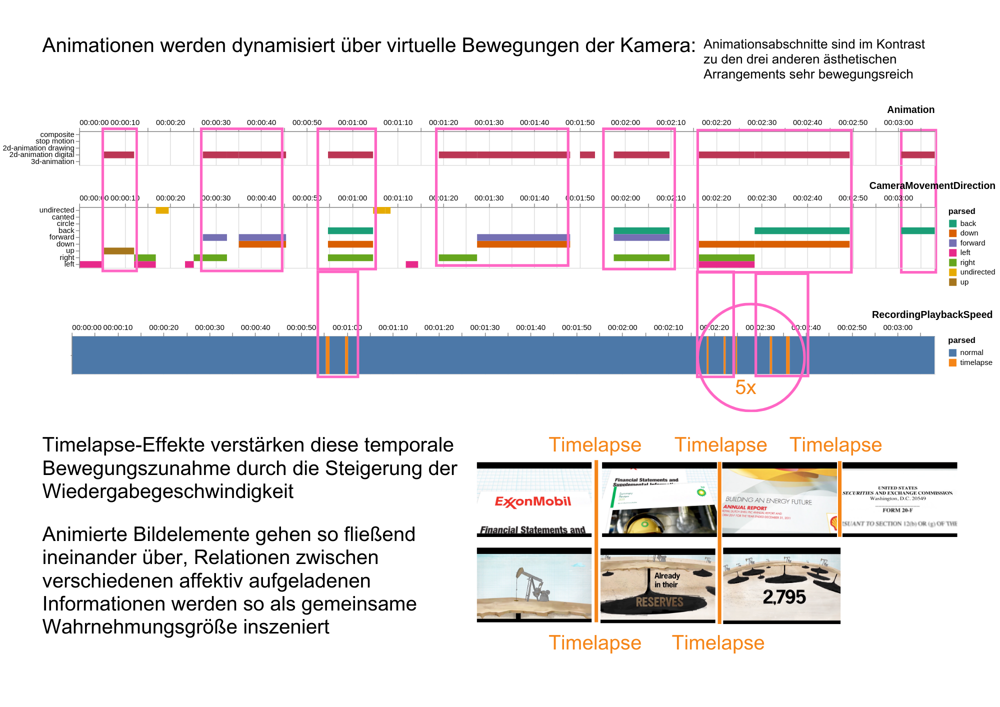
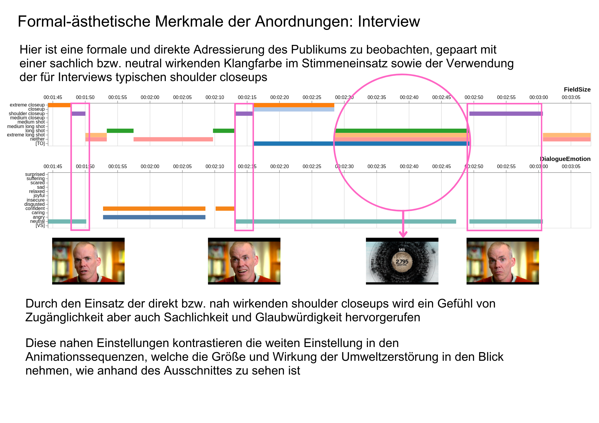
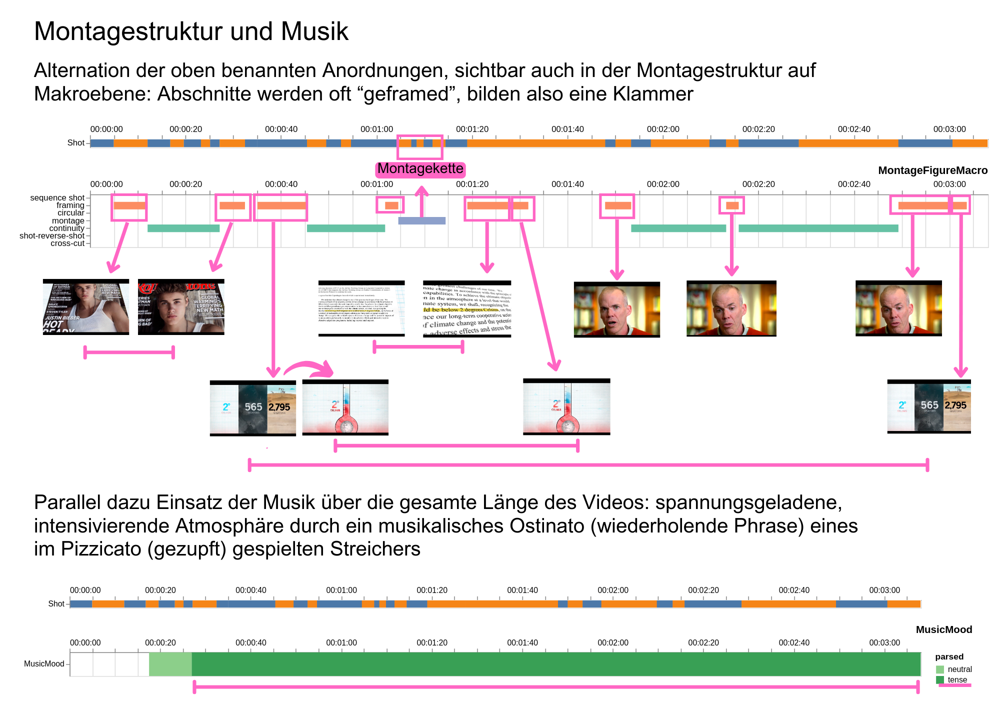

---
jupytext:
  formats: md:myst
  text_representation:
    extension: .md
    format_name: myst
kernelspec:
  display_name: Python 3
  language: python
  name: python3
---
```{code-cell} ipython3
:tags: [remove-cell]
from jupyterquiz import display_quiz

import sys
sys.path.append("..")
from quadriga_config import colors
```

# Übung zur Konfiguration der Timeline und Qualifizierung der Daten

## Aufgabe 1 

```{admonition} Übungsaufgabe
:class: exercise
<span style="color:purple">**Ziel**</span>: Identifizierung korrekter Syntaxelemente für eine vorgegebene Timeline-Visualisierung


<span style="color:purple">**Aufgabe**</span>:
Unten ist eine konfigurierte Visualisierung der Timeline zu sehen.
1. Betrachten Sie die abgebildete Timeline-Visualisierung
2. Analysieren Sie die dargestellten Eigenschaften (Höhe, Repräsentation, Labels, Farbschemata usw.)
3. Wählen Sie aus den gegebenen Optionen die korrekte Syntax-Kombination aus

<span style="color:purple">**Bearbeitungzeit**</span>: Ca. 10 Min.
```

````{margin}
➡️ Zum Vergrößern draufklicken oder ranzoomen
````

```{image} ../_images/A5-S10.png
:align: center
:height: 330px
:name: A5-S10
```

### Antwortoptionen

**A**
```bash
DominantMovementDirection(colorfield:content labels:false representation:rect legend:false colorscheme:paired), 
ImageIntrinsicMovement(height:300 representation:wave labels:true)
```

**B**
```bash
DominantMovementDirection(colorfield:parsed labels:true representation:hist legend:true colorscheme:greens),
ImageIntrinsicMovement(height:100 representation:line labels:false)
```

**C**
```bash
DominantMovementDirection(colorfield:content labels:true representation:rect legend:true colorscheme:paired),
ImageIntrinsicMovement(height:100 representation:line labels:false)
```

**D**
```bash
ImageIntrinsicMovement(height:100 representation:line labels:true),
DominantMovementDirection(colorfield:duration labels:true representation:rect legend:true colorscheme:darkblue)
```

```{code-cell} ipython3
:tags: [remove-input]
display_quiz("../quizzes/E_UK-2_Quiz-1.json", colors = colors.jupyterquiz)
```

```{admonition} Lösungsweg
:class: solution, dropdown
Hier nochmal die richtige Lösung:
+++
DominantMovementDirection(colorfield:content labels:true representation:rect legend:true colorscheme:paired), <br>
ImageIntrinsicMovement(height:100 representation:line labels:false)
+++
Gehen wir die **Syntaxelemente** einzeln durch:
+++
Für **DominantMovementDirection** gilt:
+++
`colorfield`: der Wert `content` ist korrekt, an der rechten Seite ist eine Legende aller annotierten Werte mit dem Syntaxelement `content` (also ihrem Inhalt) zu sehen.
+++
`labels`: der Wert `true` ist korrekt, da wir die Timecode-Leiste für den Annotationstypen konfiguriert haben.
+++
`representation`: der Wert `rect` ist korrekt, die Darstellungsform entspricht einem Balkendiagramm.
+++
`legend`: der Wert `true` ist korrekt, wir haben eine Legende an der rechten Seite konfiguriert.
+++
`colorscheme`: der Wert `paired` ist korrekt, wir haben uns nach dem Vega-Farbschema für ein Kategorie-Schema entschieden, um die einzelnen Inhaltswerte der Annotationen besser abbilden zu können.
+++
Für **ImageIntrinsicMovement** gilt:
+++
`height`: der Wert `100` ist korrekt. Wenn man ein wenig mit der Pixelgröße herumspielt, sieht man direkt die Unterschiede!
+++
`representation`: der Wert `line` ist korrekt, auch hier sehen die anderen Werte der Darstellungsoption `representation` ganz anders aus (durch ein wenig Ausprobieren kommt man schnell zur Lösung…).
+++
`labels`: der Wert `false` ist korrekt, wir haben die Timecode-Leiste für den Annotationstypen ausgeblendet.
```
## Aufgabe 2

Eine Visualisierung mit folgenden Eigenschaften soll erstellt werden:

In der genannten Reihenfolge sollen die Annotationstypen **Found Footage**, **Image Intrinsic Movement** und **Recording/Playback Speed** angezeigt werden. Eine Timecode-Leiste soll für alle drei Typen konfiguriert werden.

Der Annotationstyp **Found Footage** soll einzeilig mit einer Pixelhöhe von 30 dargestellt werden. Eine Legende mit dem Inhalt der Annotationen soll angezeigt werden. Als Farbschema soll `plasma` gewählt werden. 

Der Annotationstyp **Image Intrinsic Movement** soll als Histogramm mit einer Pixelhöhe von 100 angezeigt werden. Eine Legende mit dem Verlauf als `parsed` soll eingeblendet werden. Als Farbschema soll `pinkyellowgreen` gewählt werden.

Der Annotationstyp **Recording/Playback Speed** soll als Balkendiagramm mit einer Legende und den Annotationsinhalten im Farbschema `dark2` angezeigt werden.

```{admonition} Übungsaufgabe
:class: exercise
<span style="color:purple">**Ziel**</span>: Eigenständige Konfiguration einer Timeline-Visualisierung nach vorgegebenen Kriterien

<span style="color:purple">**Aufgabe**</span>:
1. Erstellen Sie eine Visualisierung mit den oben festgelegten Kriterien
3. Dokumentieren Sie die verwendete Syntax für die Konfiguration
4. Erstellen Sie einen Screenshot der fertigen Visualisierung und vergleichen Sie Ihr Ergebnis mit der Lösung

<span style="color:purple">**Bearbeitungzeit**</span>: Ca. 10-15 Min.
```

```{admonition} Lösung
:class: solution, dropdown
Folgende Konfigurationen in der Syntax haben wir eingegeben, um die oben beschriebene Ansicht zu erhalten: 


Auf was besonders zu achten ist:
+++
* Um die Syntaxelemente zu konfigurieren, müssen die Werte durch Klammern (ohne Leerzeichen) angegeben werden
* Die Syntaxreihe für jeden Annotationstypen muss mit einem Komma abgeschlossen werden
* Darstellungsoption und Wert werden mit einem Doppelpunkt ohne Leerzeichen voneinander getrennt
* Mehrere Optionen für einen Annotationstypen werden durch Leerzeichen voneinander getrennt
* Um eine einzeilige Darstellung zu konfigurieren, muss das Syntaxelement `single_line` angegeben werden (und nicht die Option `representation`)
* Wird eine Timeline neu geöffnet, finden sich unter 'Expand' alle vordefinierten Syntaxeinstellungen. Die Timeline-Leiste ist bereits standardmäßig auf `labels:true` eingestellt und muss nicht nochmal definiert werden. Zum Ausblenden der Leiste muss die Option jedoch auf `labels:false` geändert werden
* Nicht alle Annotationstypen können mit allen Repräsentationswerten angezeigt werden (hier am besten einfach ausprobieren!)

So sieht die oben beschriebene Darstellung als Datenvisualisierung aus: <br>
(...bitte ranzoomen für eine größere Ansicht)


```
(Dateninterpretation)=
## Qualifizierung der Daten: Dateninterpretation

````{margin}
```{admonition} Wichtig
:class: caution
Hier geht es einerseits um **Datenexploration**, d.h. wir fragen danach, welche Erkenntnisse liefern unsere Ergebnisse? Auf was für Auffälligkeiten stoßen wir in der Exploration der Daten? <br>
Andererseits geht es um **Dateninterpretation**, d.h. danach zu fragen, wie die Daten unter Berücksichtigung bestimmter Ansätze, Fragestellungen und kritischen Beobachtungen qualifiziert werden können.
```
````

Die Datenvisualisierung spielt eine zentrale Rolle bei der Qualifizierung des Datensatzes. Mithilfe spezifischer Anpassungsoptionen, die wir für die Analyseabschnitte konfiguriert haben, veranschaulichen wir exemplarisch, wie die visualisierten Annotationsdaten filmwissenschaftlich interpretiert werden können.
Unsere analytischen Studie konzentiert sich dabei stets auf die Interdependenzen zwischen quantitativen Datenmustern und ihrer fachspezifischen Einordnung. Welche Erkenntnisse liefern bestimmte Variablen unserer Annotationsdaten über Schnittfrequenz, Montagemuster oder Helligkeitsverhältnisse? Und wie lassen sich diese erhobenen Visualiserungsmuster des Datensatzes auf unseren audiovisuellen Gegenstand zurückbeziehen?

Sowohl die Visualisierungen als auch die Annotationen selbst sollen jedoch nicht einzig als reines Hilfsmittel begriffen werden, die lediglich dazu dienen empirische Evidenz für vorab gegebene Erkenntnisse zu liefern. Wir begreifen den Prozess der Datenerhebung und die Annotationen sowie Visualisierungen der Annotationsdaten als genuine Medien und Verfahren des Denkens mit und über Bewegtbilder {cite}`drucker2020`. 

> Das heißt Visualisierungen sind Interfaces und Medien der Analyse, sie sind wesentlicher Bestandteil eines abduktiven Forschungsprozesses, der sich mit Annotationen (wiederum in Konstellationen mit den Bewegtbildern) auseinandersetzt {cite}`stratil2024`.

Im Folgenden haben wir ein Set von Folien bereitgestellt, in denen mit Ausschnitten der Visualiserung eine Analyse unseres Gegenstandes nachvollzogen werden kann.
Eine ausführliche Analyse in Textform (mit direkten Verweisen auf die jeweiligen Folienabschnitte) steht hier als [PDF-Download](../assets/QUADRIGA-Dateninterpretation-A5.pdf) zur Verfügung. Die integrierten Folien können ebenfalls als [Datei](../assets/QUADRIGA-Slideshow-Analyse.pdf) heruntergeladen werden.

(Slideshow-Analyse)=
### Slideshow der Analyse

````{card-carousel} 1

```{card}
:class-card: carousel-card

```

```{card}
:class-card: carousel-card

```

```{card}
:class-card: carousel-card

```

```{card}
:class-card: carousel-card

```

```{card}
:class-card: carousel-card

```

```{card}
:class-card: carousel-card

```

```{card}
:class-card: carousel-card

```

```{card}
:class-card: carousel-card

```

```{card}
:class-card: carousel-card

```

```{card}
:class-card: carousel-card

```

```{card}
:class-card: carousel-card

```

```{card}
:class-card: carousel-card

```

```{card}
:class-card: carousel-card

```

```{card}
:class-card: carousel-card

```

```{card}
:class-card: carousel-card

```

```{card}
:class-card: carousel-card

```

```{card}
:class-card: carousel-card

```

```{card}
:class-card: carousel-card

```

```{card}
:class-card: carousel-card

```

```{card}
:class-card: carousel-card

```
````

## Literatur

```{bibliography}
:filter: docname in docnames
```