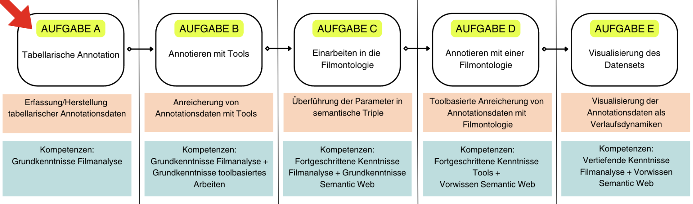

(tabellarische:annotation)=
# Tabellarische Annotation (optional)

- [](./Aufgabe_A.md)
- [](./Aufgabe_A_UK-2.md)
- [](./Aufgabe_A_UK-3.md)
- [](./Aufgabe_A_UK-4.md)


````{admonition} Erhebung filmanalytischer Daten zu audiovisuellem Material anhand tabellarischer Annotation
:class: lernziele
```{include} ../Präambel/Lernziele.md
:start-after: "<!-- START: Tabellarische Annotation (optional) -->"
:end-before: "<!-- END: Tabellarische Annotation (optional) -->"
```
````
In diesem Kapitel werden die Grundlagen tabellarischer Annotationsarbeit abgedeckt.

*Wir befinden uns hier:*

+++
Im ersten Unterkapitel [Durchführung und Schritte](../Kapitel_II/Aufgabe_A_UK-2.md) wird zunächst eine Auswahl der zu annotierenden Basisparameter (also Grundkategorien der Filmanalyse) festgelegt. Anschließend wird eine für den Untersuchungsgegenstand passende Logik der Segmentierung gewählt, um im letzten Schritt der Durchführung ein Einstellungsprotokoll zu erstellen und mit Annotationen erste filmanalytische Daten herzustellen.

Im zweiten Unterkapitel [Übung, Ergebnisauswertung und Diskussion](../Kapitel_II/Aufgabe_A_UK-3.md) widmen wir uns einer punktuellen Auswertung der Ergebnisse sowie der Diskussion über die Vor- und Nachteile dieser Methode. 


```{admonition} Bearbeitungszeit
:class: zeitinfo
Die geschätzte Bearbeitungszeit dieser Lerneinheit beträgt ca. 30–45 Minuten. Dies schließt die gekennzeichneten Übungsaufgaben, deren Bearbeitungsdauer individuell variiert, aus.

Die geschätzte Bearbeitungsdauer **inklusive** der einzelnen Übungsaufgaben beträgt ca. 150 Minuten (also 2,5 Stunden).

Bitte beachten Sie: Die tatsächliche Bearbeitungsdauer kann je nach Ihren Vorkenntnissen unterschiedlich ausfallen. Die angegebene Zeitangabe dient lediglich als Orientierungshilfe.
```


