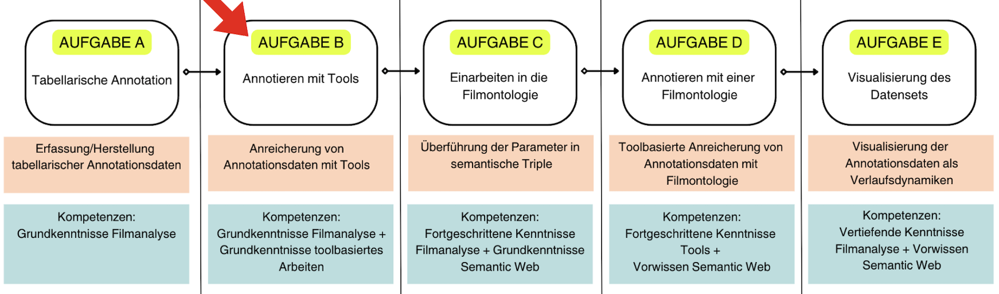

(annotation:tools)=
# Annotieren mit Tools (optional)
- [](./Aufgabe_B.md)
- [](./Aufgabe_B_UK-1.md)
- [](./Aufgabe_B_UK-2.md)
- [](./Aufgabe_B_UK-3.md)

```{admonition} Erhebung filmanalyitischer Daten anhand Freitextannotationen mit digitalen Tools
:class: lernziele

1. Die zentralen Funktionen der Annotationstools Advene und ELAN können verstanden und für filmanalytische Zwecke angewendet werden.
2. Ein filmanalytischen Datensatz kann in den Annotationstools erstellt werden.
3. Zwischen den verschiedenen Annotationstypen und Werten kann differenziert und ihr Einsatz für spezifische filmanalytische Fragestellungen begründen werden.
4. Die Unterschiede in der Datenqualität zwischen manueller tabellarischer und toolbasierter Annotation kann analysiert und bewertet werden.
```

````{margin}
```{admonition} Siehe auch
:class: seealso
Erläuterungen zum Begriff "Annotation" gibt es [hier](Aufgabe_A).
```
````
In diesem Kapitel soll das Annotieren mit Tools durch Freitexteingaben erprobt werden.
+++
*Wir befinden uns hier:*


Hierzu wird zunächst eine Parameterbestimmung und -erweiterung vorgenommen. Mit der Bestimmung unserer Parameter können wir uns anschließend der Annotationsarbeit widmen. Im Kapitel [Annotieren mit Advene](Aufgabe_B_UK-1) machen wir uns mit den Funktionsweisen von Advene vertraut und erstellen Annotationstypen sowie Annotationen. Im Kapitel [Annotieren mit ELAN](Aufgabe_B_UK-2) wiederholen wir diesen Schritt mit dem Tool ELAN. Im Anschluss besprechen wir die angewandte [Methode](Aufgabe_B_UK-3).

```{admonition} Bearbeitungszeit
:class: zeitinfo
Die geschätzte Bearbeitungszeit dieser Lerneinheit beträgt ca. 90-120 Min. Dies schließt die gekennzeichneten Übungsaufgaben, deren Bearbeitungsdauer individuell variiert, aus. 

Die geschätzte Bearbeitungszeit **inklusive** der Übungsaufgaben kann mehrere Stunden in Anspruch nehmen. Die Dauer variiert je nach individuellem Tempo bei der Erstellung der Annotationspakete. Im Durchschnitt sollten Sie etwa 5 Stunden einplanen, inklusive der Erstellung eines Annotationsdatensets in einem der Programme (Advene oder ELAN).

Bitte beachten Sie: Die tatsächliche Bearbeitungsdauer kann je nach Ihren Vorkenntnissen unterschiedlich ausfallen. Die angegebene Zeitangabe dient lediglich als Orientierungshilfe.
```
