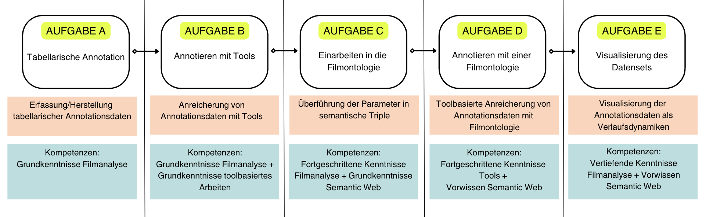

# Reflexion

In unserer Fallstudie "Affektrhetoriken in Online-Videos zur Klimakrise" wurden anhand von digitalen Annotationsverfahren filmanalytische Primärdaten hergestellt, durch die spezifische Inszenierungsmuster, Verlaufsdynamiken und Affektrhetoriken erkennbar werden. 

Fünf übergeordnete Lernmodule führen hierbei Schritt für Schritt beispielhaft durch den Prozess der Datenerstellung – und Organisation durch:



Die Arbeit mit einer Datenontologie nach Semantic Web Standards steht hierbei im Fokus der Analysemethoden und bildet das Kernstück vorliegender Fallstudie. 

## Tabelle und Freitexannotation

Um ein Verständnis dafür zu schaffen, was eine Datenontologie leistet und wie sie für filmwissenschaftliche Analysen entwickelt und genutzt werden kann, haben wir die dafür notwendigen Vorkenntnisse als eigene Lernmodule bereitgestellt. Diese umfassen in einem ersten Schritt die Erstellung von Annotationsdaten mittels einer [Tabelle](../Kapitel_II/Aufgabe_A.md):

```{figure} ../assets/Tabelle-Auszug.png
---
align: center
name: tabelle-auszug
---

Auszug der tabellarischen Annotation
```

Anschließend werden im zweiten Lernmodul erste Schritte des Arbeitens mit digitalen [Annotationstools](../Kapitel_II/Aufgabe_B.md) für semantisch strukturierte Bewegtbildanalysen adressiert:

```{figure} ../assets/Advene-Oberfläche.png
---
align: center
name: advene-oberfläche
---

Interface der Annotationsanwendung Advene
```
## Von Freitextannotation zur Ontologie

Sowohl die tabellarische Annotation als auch die Arbeit mit digitalen Tools haben gezeigt, dass ein Datenframework für die Vereinheitlichung, Vergleichbarkeit und Taxonomisierung filmanalytischer Termini eine Leerstelle hinsichtlich der Datenproduktion darstellt. Das Vorhaben zur Entwicklung eines systematischen Datenmodells für die Herstellung feingliederiger und präziser Annotationen ergibt sich somit aus dieser vorherrschenden Lücke. Dies betrifft insbesondere die Frage danach, wie vergleichende Analysen größerer Korpora ohne automatische Erkenneralgorithmen überhaupt zu bewältigen wären. Unter der Leitung von Prof. Dr. Jan-Hendrik Bakels entwickelte das BMBF geförderte Projekt "<a href="https://www.ada.cinepoetics.fu-berlin.de/index.html" class="external-link" target="_blank">Affektrhetoriken des Audiovisuellen</a>"  (kurz: AdA, Laufzeit 2016-2021) eine Datenontologie, die diese spezifischen Anforderungen digitaler Analysen für die Filmwissenschaft in den Blick nimmt. Wie kann filmanalytisches Vokabular in eine Filmontologie überführt werden? Was ist das Ergebnis dieses Prozesses und wie kann die Arbeit mit einer solchen speziell entwickelten Ontologie im Forschungsalltag von Film- und Medienwissenschaftler:innen aussehen? In den drei folgenden Lernmodulen haben wir diese Fragen unter Berücksichtigung etwaiger Probleme und Grenzen der angewandten Analysemethode adressiert. 

Eine nähere Auseinandersetzung mit der Datenerhebung erforderte hier zunächst das Nachvollziehbarmachen von Prinzipien und Logiken des [Semantic Web](../Kapitel_II/Aufgabe_C.md). Anschließend konnte gezeigt werden, wie anhand dieser Prinzipien eine Überführung filmanalytischer Grundbegriffe und Konzepte in eine semantisch strukturierte Datenarchitektur – die AdA-Filmontologie – vollzogen werden kann. Die AdA-Filmontologie ist ein Datenframework, das feingliedrige Annotationen ermöglicht.

```{image} ../assets/AdA-Struktur-Ontoviz.png
:align: center
:height: 450px
:name: ada-ontoviz-2
```
Für die Datenerhebung unserer Fallstudie haben wir mit der AdA-Filmontologie in dem Tool Advene gearbeitet. Anhand eines Beispielvideos zur Klimakrise, das den Konflikt zwischen der fossilen Brennstoffindustrie und internationalen Bemühungen zur Senkung des Co2-Austoßes adressiert, wurde ein Set an Annotationsdaten erstellt: 

```{figure} ../assets/Advene-Oberfläche-2.png
---
align: center
name: advene-oberfläche-2
---

Interface der Annotationsdaten mit der AdA-Ontologie in Advene
```
Zwei umfangreiche Videotutorials und die schrittweise Skizzierung unseres Workflows helfen dabei die Datenerhebung zu reproduzieren. Nicht alle Entscheidungen sind hierbei selbsterklärend und die Durchführung der Datenerhebung anhand der Ontologie zeigt schnell, welche konzeptionellen Leerstellen mit der Systematisierung filmanalytischer Begriffe einhergehen. Die anschließende Diskussion der Ergebnisse soll an dieser Stelle einerseits Transparenz für Entscheidungsprozesse schaffen, andererseits werden Anpassungsoptionen und Erweiterungsmöglichkeiten besprochen, die die spezifischen Charakteristika unseres Beispielgegenstandes miteinbeziehen. 

Die AdA-Filmontologie soll User:innen größtmögliche Flexibilität in der Anwendung bieten. Insofern besteht grundsätzlich immer die Möglichkeit, die Anwendungsbereiche nach der je eigenen Forschungsfrage auszurichten. 

## Von der Ontologie zur Visualisierung

Das letzte Lernmodul beschäftigt sich mit einer eigens entwickelten Visualisierungsansicht: die AdA-Timeline. Die AdA-Timeline ist darauf ausgelegt, die in Advene mit der AdA-Ontologie erhobenen Annotationsdaten zu explorieren.  Mittels konfigurierbarer Darstellungsoptionen kann die Timeline spezifisch angepasst werden. Neben der Datenexploration ermöglicht die Visualisierung der Daten ebenfalls Hypothesenpräsentationen in Forschungszusammenhängen. Durch die Visualisierungsoptionen der Annotationen können die Daten, beispielsweise für eine filmanalytische Qualifizierung, publiziert werden. Hier ist ein konfigurierter Ausschnitt aus unserem Annotationspaket zu sehen:

````{margin}
➡️ Zum Vergrößern draufklicken oder ranzoomen
````

```{figure} ../assets/Auschnitt-AdA-Timeline.svg
---
align: center
height: 500px
name: ausschnitt-ada-timeline
---

Konfigurierte Visualisierung der AdA-Timeline
```

