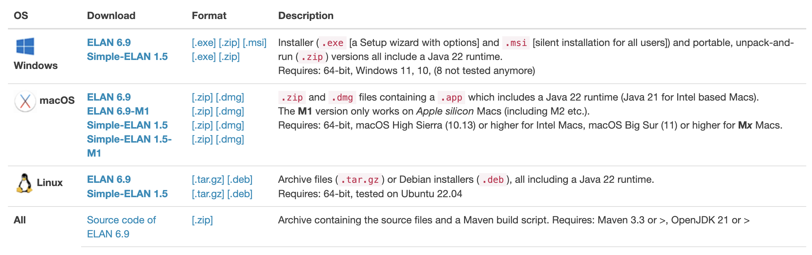

# Technische Voraussetzungen

Zur Durchführung von Annotationen nutzen wir die frei zugänglichen Programme **Advene** und **ELAN**. Instruktionen sowie Hinweise zum Download für MacOS, Windows sowie Linux gibt es auf den jeweiligen Download-Seiten für <a href="https://www.advene.org/download.html#download" class="external-link" target="_blank">Advene</a> bzw. für <a href="https://archive.mpi.nl/tla/elan/download" class="external-link" target="_blank">ELAN</a>.

## ELAN Download

ELAN bietet mehrere Versionen zum Download an:



Wir empfehlen mit der neusten Release-Version zu arbeiten, da diese die wichtigsten Updates und Fehlerbehebungen enthält. Die aktuelleste Version (letzter Release Dezember 2024) ist `ELAN 6.9`. Mehr Infos zu den release notes gibt es auf der <a href="https://archive.mpi.nl/tla/elan/release-notes" class="external-link" target="_blank"> Projektseite</a>.

## Advene Download 

````{margin}
```{admonition} Wichtiger Hinweis
:class: caution
Bei Problemen mit dem Download oder der Software können Sie über den <a href="https://github.com/oaubert/advene/issues" class="external-link" target="_blank"> Github-Projektaccount</a> von Advene direkt ein Issue erstellen. Hierzu benötigen Sie einen (kostenlosen) Github-Account.
```
````

Auf der Seite von Advene wird immer die aktuellste Version der Software zum Download angeboten.

Der Download der **Windows-Version** muss über einen Admin-Account des genutzten Rechners erfolgen.

Über die <a href="https://github.com/oaubert/advene/" class="external-link" target="_blank">Projektseite</a> auf Github kann ebenfalls die Advene Development-Version für Linux heruntergeladen werden.

```{admonition} Für wen ist die Development-Version geeignet?
:class: hinweis

Technisch versierte Nutzer:innen können alternativ auch die Development-Version von Advene herunterladen. Diese enthält die jeweils neuesten Funktionen, Erweiterungen und Bugfixes, die vom Entwickler bereitgestellt werden. Die Development-Version eignet sich daher insbesondere für Anwender:innen, die regelmäßig mit den aktuellsten Updates arbeiten möchten und Interesse daran haben, Advene stets in seiner neuesten Entwicklungsstufe zu nutzen.
Für die Annotationsarbeit sind jedoch die angebotenen regulären Download-Versionen für Mac und Windows in jedem Fall vollkommen ausreichend – sie bieten alle notwendigen Funktionen für eine zuverlässige Nutzung.

```

### Installationsanleitung Advene für Linux mit einer virtuellen Maschine

````{margin}
```{admonition} Hinweis
:class: hinweis 
*Parallels Desktop* ist beispielsweise eine (kostenpflichtige) Möglichkeit, eine virtuelle Maschine auf einem Mac zu installieren und zu verwalten.
```
````

Wenn Sie die Development-Version für Linux über einen Mac nutzen wollen, können Sie sich eine virtuelle Maschine einrichten und in dieser Linux installieren. 

```{admonition} Achtung
:class: caution
Diese Installationsmethode empfehlen wir für technisch versiertere Nutzer:innen.
```

### Schritt-für-Schritt Anleitung

Für das Installationspaket und -anleitung siehe: <a href="https://www.advene.org/download.html#download" class="external-link" target="_blank">http://advene.org/download.html#download</a>

#### Einrichtung Repository

Um *Ubuntu* das Installieren aus einem unbekannten Repository zu genemigen, wird hier das Git-Repository des Entwicklers Olivier Aubert als vertrauenswürdige Quelle im System hinterlegt:

````{margin}
```{admonition} Hinweis
:class: hinweis
Befehle, die in das Terminal eingegeben werden, sind durch ein `$ `&nbsp;am Anfang der Zeile gekennzeichnet. Zeilen ohne `$ `&nbsp;am Anfang sind (Beispiel-)Ausgaben der Befehle.

Wollen Sie einen Befehl kopieren, so dürfen Sie das `$ `&nbsp;am Anfang nicht mit kopieren.

Mehr über Terminals, Command Shells und Unix können Sie auf der <a href="https://quadriga-dk.github.io/Book_Template/entwicklung/unix.html" class="external-link" target="_blank">Unix-Unterseite des QUADRIGA Templates</a> nachlesen. Dort finden Sie auch Hinweise auf weiterführende Lern-Ressourcen.
```
````

```bash
$ sudo wget --quiet -O /etc/apt/sources.list.d/advene.list 
https://olivieraubert.net/advene/debian/binary/advene.list
$ wget --quiet -O - https://olivieraubert.net/olivieraubert.asc | sudo apt-key add -
```

#### Installation Advene

Nach der Einrichtung des Repositorys erfolgt nun die tatsächliche Installation des Programms selbst.

```bash
$ sudo apt update && sudo apt install advene advene-full
```

#### Development Version

Aktuellste Entwicklungen der Software können in der Development-Version benutzt werden. Um alle notwendigen Hilfsprogramme auf dem Rechner zu haben, muss zunächst die aktuell veröffentlichte Advene Version installiert werden (siehe oben).

Danach kann durch die folgenden Eingaben die Development-Version aus dem Git-Repository des Entwicklers bezogen werden:

```bash
$ mkdir src
$ cd src
$ git clone https://github.com/oaubert/advene.git
```


````{margin}
```{admonition} Achtung
:class: caution
Start via Programm-Icon öffnet den regulären Release!
```
````
Bei jedem Start kann nun mit den Befehlen `cd src/advene` sowie `GDK_BACKEND=x11 advene` die Development-Version von Advene geöffnet werden.